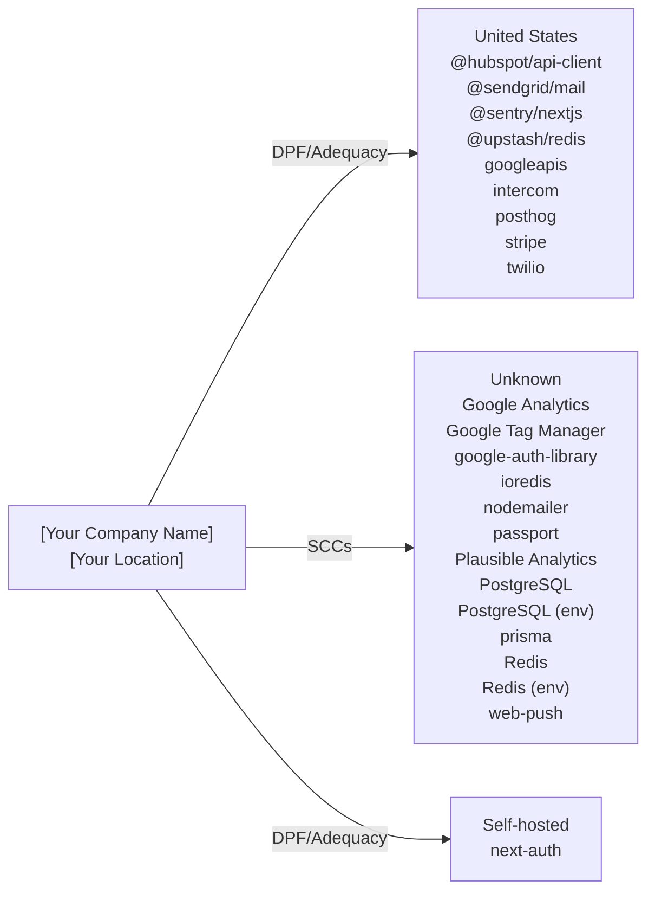

# Cross-Border Data Transfer Map

> **Document Version:** 1.0  
> **Document Owner:** [Your Company Name]  
> **Next Review Date:** 2027-03-16

**Organisation:** [Your Company Name]
**Data Exporter Location:** [Your Location]
**Project:** calcom-monorepo
**Generated:** 2026-03-16

---

> This document maps all international data transfers identified through code analysis. It identifies the destination country, service provider, data types transferred, and applicable legal safeguards for each transfer. Required under GDPR Chapter V (Articles 44-49) for EU data exporters.

## Transfer Flow Diagram

## Transfer Summary by Country

| Country | Services | Data Types | Safeguard | Adequacy Decision |
|---------|----------|-----------|-----------|-------------------|
| United States (US) | @hubspot/api-client, @sendgrid/mail, @sentry/nextjs, @upstash/redis, googleapis, intercom, posthog, stripe, twilio | contact information, email addresses, names, phone numbers | EU-US DPF / SCCs | Yes |
| Unknown (??) | Google Analytics, Google Tag Manager, google-auth-library, ioredis, nodemailer, passport, Plausible Analytics, PostgreSQL, PostgreSQL (env), prisma, Redis, Redis (env), web-push | page views, user behavior, device information, IP address | [Verify with provider] | No |
| Self-hosted (—) | next-auth | email, name, profile picture, OAuth tokens | No third-party transfer | Yes |

## Detailed Transfer Register

| # | Service | Category | Country | Data Types | Safeguard | DPF Certified | DPA in Place |
|---|---------|----------|---------|-----------|-----------|---------------|-------------|
| 1 | @hubspot/api-client | other | United States | contact information, email addresses, names | EU-US DPF / SCCs | [Verify](https://www.dataprivacyframework.gov/list) | [ ] |
| 2 | @sendgrid/mail | email | United States | email addresses, email content | EU-US DPF / SCCs | [Verify](https://www.dataprivacyframework.gov/list) | [ ] |
| 3 | @sentry/nextjs | monitoring | United States | error data, stack traces, user context | SCCs | N/A | [ ] |
| 4 | @upstash/redis | database | United States | cached data, session data | SCCs | N/A | [ ] |
| 5 | Google Analytics | analytics | Unknown | page views, user behavior, device information | [Verify with provider] | N/A | [ ] |
| 6 | Google Tag Manager | analytics | Unknown | page views, user behavior, custom events | [Verify with provider] | N/A | [ ] |
| 7 | google-auth-library | auth | Unknown | OAuth tokens, Google profile data, email | [Verify with provider] | N/A | [ ] |
| 8 | googleapis | other | United States | user data via Google APIs, calendar data, email data | EU-US DPF / SCCs | [Verify](https://www.dataprivacyframework.gov/list) | [ ] |
| 9 | intercom | other | United States | user profiles, email, name | SCCs | N/A | [ ] |
| 10 | ioredis | database | Unknown | cached data, session data | [Verify with provider] | N/A | [ ] |
| 11 | next-auth | auth | Self-hosted | email, name, profile picture | No third-party transfer | [Verify](https://www.dataprivacyframework.gov/list) | [ ] |
| 12 | nodemailer | email | Unknown | email addresses, email content | [Verify with provider] | N/A | [ ] |
| 13 | passport | auth | Unknown | email, name, OAuth tokens | [Verify with provider] | N/A | [ ] |
| 14 | Plausible Analytics | analytics | Unknown | page views, referrer data, device information | [Verify with provider] | N/A | [ ] |
| 15 | PostgreSQL | database | Unknown | application data, user records | [Verify with provider] | N/A | [ ] |
| 16 | PostgreSQL (env) | database | Unknown | application data, user records | [Verify with provider] | N/A | [ ] |
| 17 | posthog | analytics | United States | user behavior, session recordings, feature flag usage | SCCs | N/A | [ ] |
| 18 | prisma | database | Unknown | user data as defined in schema | [Verify with provider] | N/A | [ ] |
| 19 | Redis | database | Unknown | session data, cache data | [Verify with provider] | N/A | [ ] |
| 20 | Redis (env) | database | Unknown | session data, cache data | [Verify with provider] | N/A | [ ] |
| 21 | stripe | payment | United States | payment information, billing address, email | EU-US DPF / SCCs | [Verify](https://www.dataprivacyframework.gov/list) | [ ] |
| 22 | twilio | other | United States | phone numbers, SMS message content, voice call metadata | EU-US DPF / SCCs | [Verify](https://www.dataprivacyframework.gov/list) | [ ] |
| 23 | web-push | other | Unknown | push subscription endpoints, device tokens, notification content | [Verify with provider] | N/A | [ ] |

## Services Requiring Additional Safeguards

The following services transfer data to countries without an EU adequacy decision. Additional safeguards (SCCs + supplementary measures) are required per the Schrems II ruling.

### @sentry/nextjs

- **Destination:** United States
- **Safeguard:** SCCs
- **Data:** error data, stack traces, user context, device information, IP address, performance profiles
- **Required actions:**
  - [ ] Execute Standard Contractual Clauses (Module 2: Controller to Processor)
  - [ ] Complete Annex I (List of parties)
  - [ ] Complete Annex II (Technical and organisational measures)
  - [ ] Verify provider's DPF certification status
  - [ ] Implement supplementary encryption measures if needed

### @upstash/redis

- **Destination:** United States
- **Safeguard:** SCCs
- **Data:** cached data, session data
- **Required actions:**
  - [ ] Execute Standard Contractual Clauses (Module 2: Controller to Processor)
  - [ ] Complete Annex I (List of parties)
  - [ ] Complete Annex II (Technical and organisational measures)
  - [ ] Verify provider's DPF certification status
  - [ ] Implement supplementary encryption measures if needed

### Google Analytics

- **Destination:** Unknown
- **Safeguard:** [Verify with provider]
- **Data:** page views, user behavior, device information, IP address, location data
- **Required actions:**
  - [ ] Execute Standard Contractual Clauses (Module 2: Controller to Processor)
  - [ ] Complete Annex I (List of parties)
  - [ ] Complete Annex II (Technical and organisational measures)
  - [ ] Verify provider's DPF certification status
  - [ ] Implement supplementary encryption measures if needed

### Google Tag Manager

- **Destination:** Unknown
- **Safeguard:** [Verify with provider]
- **Data:** page views, user behavior, custom events, device information, third-party tag data
- **Required actions:**
  - [ ] Execute Standard Contractual Clauses (Module 2: Controller to Processor)
  - [ ] Complete Annex I (List of parties)
  - [ ] Complete Annex II (Technical and organisational measures)
  - [ ] Verify provider's DPF certification status
  - [ ] Implement supplementary encryption measures if needed

### google-auth-library

- **Destination:** Unknown
- **Safeguard:** [Verify with provider]
- **Data:** OAuth tokens, Google profile data, email
- **Required actions:**
  - [ ] Execute Standard Contractual Clauses (Module 2: Controller to Processor)
  - [ ] Complete Annex I (List of parties)
  - [ ] Complete Annex II (Technical and organisational measures)
  - [ ] Verify provider's DPF certification status
  - [ ] Implement supplementary encryption measures if needed

### intercom

- **Destination:** United States
- **Safeguard:** SCCs
- **Data:** user profiles, email, name, conversations, user behavior, company data
- **Required actions:**
  - [ ] Execute Standard Contractual Clauses (Module 2: Controller to Processor)
  - [ ] Complete Annex I (List of parties)
  - [ ] Complete Annex II (Technical and organisational measures)
  - [ ] Verify provider's DPF certification status
  - [ ] Implement supplementary encryption measures if needed

### ioredis

- **Destination:** Unknown
- **Safeguard:** [Verify with provider]
- **Data:** cached data, session data
- **Required actions:**
  - [ ] Execute Standard Contractual Clauses (Module 2: Controller to Processor)
  - [ ] Complete Annex I (List of parties)
  - [ ] Complete Annex II (Technical and organisational measures)
  - [ ] Verify provider's DPF certification status
  - [ ] Implement supplementary encryption measures if needed

### nodemailer

- **Destination:** Unknown
- **Safeguard:** [Verify with provider]
- **Data:** email addresses, email content
- **Required actions:**
  - [ ] Execute Standard Contractual Clauses (Module 2: Controller to Processor)
  - [ ] Complete Annex I (List of parties)
  - [ ] Complete Annex II (Technical and organisational measures)
  - [ ] Verify provider's DPF certification status
  - [ ] Implement supplementary encryption measures if needed

### passport

- **Destination:** Unknown
- **Safeguard:** [Verify with provider]
- **Data:** email, name, OAuth tokens, session data
- **Required actions:**
  - [ ] Execute Standard Contractual Clauses (Module 2: Controller to Processor)
  - [ ] Complete Annex I (List of parties)
  - [ ] Complete Annex II (Technical and organisational measures)
  - [ ] Verify provider's DPF certification status
  - [ ] Implement supplementary encryption measures if needed

### Plausible Analytics

- **Destination:** Unknown
- **Safeguard:** [Verify with provider]
- **Data:** page views, referrer data, device information
- **Required actions:**
  - [ ] Execute Standard Contractual Clauses (Module 2: Controller to Processor)
  - [ ] Complete Annex I (List of parties)
  - [ ] Complete Annex II (Technical and organisational measures)
  - [ ] Verify provider's DPF certification status
  - [ ] Implement supplementary encryption measures if needed

### PostgreSQL

- **Destination:** Unknown
- **Safeguard:** [Verify with provider]
- **Data:** application data, user records
- **Required actions:**
  - [ ] Execute Standard Contractual Clauses (Module 2: Controller to Processor)
  - [ ] Complete Annex I (List of parties)
  - [ ] Complete Annex II (Technical and organisational measures)
  - [ ] Verify provider's DPF certification status
  - [ ] Implement supplementary encryption measures if needed

### PostgreSQL (env)

- **Destination:** Unknown
- **Safeguard:** [Verify with provider]
- **Data:** application data, user records
- **Required actions:**
  - [ ] Execute Standard Contractual Clauses (Module 2: Controller to Processor)
  - [ ] Complete Annex I (List of parties)
  - [ ] Complete Annex II (Technical and organisational measures)
  - [ ] Verify provider's DPF certification status
  - [ ] Implement supplementary encryption measures if needed

### posthog

- **Destination:** United States
- **Safeguard:** SCCs
- **Data:** user behavior, session recordings, feature flag usage, device information
- **Required actions:**
  - [ ] Execute Standard Contractual Clauses (Module 2: Controller to Processor)
  - [ ] Complete Annex I (List of parties)
  - [ ] Complete Annex II (Technical and organisational measures)
  - [ ] Verify provider's DPF certification status
  - [ ] Implement supplementary encryption measures if needed

### prisma

- **Destination:** Unknown
- **Safeguard:** [Verify with provider]
- **Data:** user data as defined in schema
- **Required actions:**
  - [ ] Execute Standard Contractual Clauses (Module 2: Controller to Processor)
  - [ ] Complete Annex I (List of parties)
  - [ ] Complete Annex II (Technical and organisational measures)
  - [ ] Verify provider's DPF certification status
  - [ ] Implement supplementary encryption measures if needed

### Redis

- **Destination:** Unknown
- **Safeguard:** [Verify with provider]
- **Data:** session data, cache data
- **Required actions:**
  - [ ] Execute Standard Contractual Clauses (Module 2: Controller to Processor)
  - [ ] Complete Annex I (List of parties)
  - [ ] Complete Annex II (Technical and organisational measures)
  - [ ] Verify provider's DPF certification status
  - [ ] Implement supplementary encryption measures if needed

### Redis (env)

- **Destination:** Unknown
- **Safeguard:** [Verify with provider]
- **Data:** session data, cache data
- **Required actions:**
  - [ ] Execute Standard Contractual Clauses (Module 2: Controller to Processor)
  - [ ] Complete Annex I (List of parties)
  - [ ] Complete Annex II (Technical and organisational measures)
  - [ ] Verify provider's DPF certification status
  - [ ] Implement supplementary encryption measures if needed

### web-push

- **Destination:** Unknown
- **Safeguard:** [Verify with provider]
- **Data:** push subscription endpoints, device tokens, notification content
- **Required actions:**
  - [ ] Execute Standard Contractual Clauses (Module 2: Controller to Processor)
  - [ ] Complete Annex I (List of parties)
  - [ ] Complete Annex II (Technical and organisational measures)
  - [ ] Verify provider's DPF certification status
  - [ ] Implement supplementary encryption measures if needed

## Data Type × Service Matrix

| Data Type | @hubspot/api-client | @sendgrid/mail | @sentry/nextjs | @upstash/redis | Google Analytics | Google Tag Manager | google-auth-library | googleapis | intercom | ioredis | next-auth | nodemailer | passport | Plausible Analytics | PostgreSQL | PostgreSQL (env) | posthog | prisma | Redis | Redis (env) | stripe | twilio | web-push |
| --- | --- | --- | --- | --- | --- | --- | --- | --- | --- | --- | --- | --- | --- | --- | --- | --- | --- | --- | --- | --- | --- | --- | --- |
| contact information | ● | — | — | — | — | — | — | — | — | — | — | — | — | — | — | — | — | — | — | — | — | — | — |
| email addresses | ● | ● | — | — | — | — | — | — | — | — | — | ● | — | — | — | — | — | — | — | — | — | — | — |
| names | ● | — | — | — | — | — | — | — | — | — | — | — | — | — | — | — | — | — | — | — | — | — | — |
| phone numbers | ● | — | — | — | — | — | — | — | — | — | — | — | — | — | — | — | — | — | — | — | — | ● | — |
| company data | ● | — | — | — | — | — | — | — | ● | — | — | — | — | — | — | — | — | — | — | — | — | — | — |
| deal information | ● | — | — | — | — | — | — | — | — | — | — | — | — | — | — | — | — | — | — | — | — | — | — |
| engagement history | ● | — | — | — | — | — | — | — | — | — | — | — | — | — | — | — | — | — | — | — | — | — | — |
| email content | — | ● | — | — | — | — | — | — | — | — | — | ● | — | — | — | — | — | — | — | — | — | — | — |
| error data | — | — | ● | — | — | — | — | — | — | — | — | — | — | — | — | — | — | — | — | — | — | — | — |
| stack traces | — | — | ● | — | — | — | — | — | — | — | — | — | — | — | — | — | — | — | — | — | — | — | — |
| user context | — | — | ● | — | — | — | — | — | — | — | — | — | — | — | — | — | — | — | — | — | — | — | — |
| device information | — | — | ● | — | ● | ● | — | — | — | — | — | — | — | ● | — | — | ● | — | — | — | — | — | — |
| IP address | — | — | ● | — | ● | — | — | — | — | — | — | — | — | — | — | — | — | — | — | — | — | — | — |
| performance profiles | — | — | ● | — | — | — | — | — | — | — | — | — | — | — | — | — | — | — | — | — | — | — | — |
| cached data | — | — | — | ● | — | — | — | — | — | ● | — | — | — | — | — | — | — | — | — | — | — | — | — |
| session data | — | — | — | ● | — | — | — | — | — | ● | ● | — | ● | — | — | — | — | — | ● | ● | — | — | — |
| page views | — | — | — | — | ● | ● | — | — | — | — | — | — | — | ● | — | — | — | — | — | — | — | — | — |
| user behavior | — | — | — | — | ● | ● | — | — | ● | — | — | — | — | — | — | — | ● | — | — | — | — | — | — |
| location data | — | — | — | — | ● | — | — | — | — | — | — | — | — | — | — | — | — | — | — | — | — | — | — |
| custom events | — | — | — | — | — | ● | — | — | — | — | — | — | — | — | — | — | — | — | — | — | — | — | — |
| third-party tag data | — | — | — | — | — | ● | — | — | — | — | — | — | — | — | — | — | — | — | — | — | — | — | — |
| OAuth tokens | — | — | — | — | — | — | ● | — | — | — | ● | — | ● | — | — | — | — | — | — | — | — | — | — |
| Google profile data | — | — | — | — | — | — | ● | — | — | — | — | — | — | — | — | — | — | — | — | — | — | — | — |
| email | — | — | — | — | — | — | ● | — | ● | — | ● | — | ● | — | — | — | — | — | — | — | ● | — | — |
| user data via Google APIs | — | — | — | — | — | — | — | ● | — | — | — | — | — | — | — | — | — | — | — | — | — | — | — |
| calendar data | — | — | — | — | — | — | — | ● | — | — | — | — | — | — | — | — | — | — | — | — | — | — | — |
| email data | — | — | — | — | — | — | — | ● | — | — | — | — | — | — | — | — | — | — | — | — | — | — | — |
| profile information | — | — | — | — | — | — | — | ● | — | — | — | — | — | — | — | — | — | — | — | — | — | — | — |
| user profiles | — | — | — | — | — | — | — | — | ● | — | — | — | — | — | — | — | — | — | — | — | — | — | — |
| name | — | — | — | — | — | — | — | — | ● | — | ● | — | ● | — | — | — | — | — | — | — | — | — | — |
| conversations | — | — | — | — | — | — | — | — | ● | — | — | — | — | — | — | — | — | — | — | — | — | — | — |
| profile picture | — | — | — | — | — | — | — | — | — | — | ● | — | — | — | — | — | — | — | — | — | — | — | — |
| referrer data | — | — | — | — | — | — | — | — | — | — | — | — | — | ● | — | — | — | — | — | — | — | — | — |
| application data | — | — | — | — | — | — | — | — | — | — | — | — | — | — | ● | ● | — | — | — | — | — | — | — |
| user records | — | — | — | — | — | — | — | — | — | — | — | — | — | — | ● | ● | — | — | — | — | — | — | — |
| session recordings | — | — | — | — | — | — | — | — | — | — | — | — | — | — | — | — | ● | — | — | — | — | — | — |
| feature flag usage | — | — | — | — | — | — | — | — | — | — | — | — | — | — | — | — | ● | — | — | — | — | — | — |
| user data as defined in schema | — | — | — | — | — | — | — | — | — | — | — | — | — | — | — | — | — | ● | — | — | — | — | — |
| cache data | — | — | — | — | — | — | — | — | — | — | — | — | — | — | — | — | — | — | ● | ● | — | — | — |
| payment information | — | — | — | — | — | — | — | — | — | — | — | — | — | — | — | — | — | — | — | — | ● | — | — |
| billing address | — | — | — | — | — | — | — | — | — | — | — | — | — | — | — | — | — | — | — | — | ● | — | — |
| transaction history | — | — | — | — | — | — | — | — | — | — | — | — | — | — | — | — | — | — | — | — | ● | — | — |
| SMS message content | — | — | — | — | — | — | — | — | — | — | — | — | — | — | — | — | — | — | — | — | — | ● | — |
| voice call metadata | — | — | — | — | — | — | — | — | — | — | — | — | — | — | — | — | — | — | — | — | — | ● | — |
| call recordings | — | — | — | — | — | — | — | — | — | — | — | — | — | — | — | — | — | — | — | — | — | ● | — |
| push subscription endpoints | — | — | — | — | — | — | — | — | — | — | — | — | — | — | — | — | — | — | — | — | — | — | ● |
| device tokens | — | — | — | — | — | — | — | — | — | — | — | — | — | — | — | — | — | — | — | — | — | — | ● |
| notification content | — | — | — | — | — | — | — | — | — | — | — | — | — | — | — | — | — | — | — | — | — | — | ● |

## Transfer Compliance Checklist

- [ ] All transfers have a valid legal basis under GDPR Chapter V
- [ ] SCCs (2021 version) executed with all non-DPF-certified providers
- [ ] DPF certification verified for applicable US providers
- [ ] Transfer Impact Assessment completed for each non-adequate country
- [ ] Supplementary measures implemented where SCCs are relied upon
- [ ] Data Processing Agreements in place with all processors
- [ ] Record of Processing Activities updated with transfer details
- [ ] Privacy Policy discloses international transfers and safeguards
- [ ] DPO informed of all cross-border transfers

## Review Schedule

| Review | Frequency | Next Due |
|--------|-----------|----------|
| Full transfer map review | Annual | 2027-03-16 |
| DPF certification verification | Semi-annual | [Set date] |
| New service onboarding review | Per event | Ongoing |
| Regulatory change assessment | Quarterly | [Set date] |

**Contact:** [your-email@example.com]

---

*This Cross-Border Transfer Map was auto-generated by [Codepliant](https://github.com/joechensmartz/codepliant) based on code analysis. Service location and DPF certification status should be verified with each provider's current documentation. This document does not constitute legal advice.*
