# Data Lifecycle Diagram — [Your Company Name]

> Auto-generated by Codepliant on 2026-03-16.
> Shows the full data lifecycle from collection through deletion for each data type.
> **Document Version:** 1.0  
> **Document Owner:** [Your Company Name]  
> **Next Review Date:** 2027-03-16

## Lifecycle Overview

All personal data processed by this application follows a defined lifecycle:

**Collection** — Data is gathered from users or systems
**Processing** — Data is used for its intended purpose
**Storage** — Data is persisted with appropriate safeguards
**Sharing** — Data may be transferred to authorized third parties
**Deletion** — Data is removed per retention schedule or on request

## Lifecycle Diagram

```mermaid
graph LR
  subgraph Lifecycle["Data Lifecycle"]
    C["Collection"] --> P["Processing"]
    P --> S["Storage"]
    S --> SH["Sharing"]
    S --> D["Deletion"]
  end

  subgraph DT0["Identity  Account Data"]
    DT0C["Collect"] --> DT0P["Process"]
    DT0P --> DT0S["Store"]
    DT0S --> DT0D["Delete\nUntil account deletion"]
  end

  subgraph DT1["Payment  Billing Data"]
    DT1C["Collect"] --> DT1P["Process"]
    DT1P --> DT1S["Store"]
    DT1S --> DT1D["Delete\n7 years (tax/legal)"]
  end

  subgraph DT2["Behavioral  Analytics Data"]
    DT2C["Collect"] --> DT2P["Process"]
    DT2P --> DT2S["Store"]
    DT2S --> DT2D["Delete\n26 months"]
  end

  subgraph DT3["Communication Data"]
    DT3C["Collect"] --> DT3P["Process"]
    DT3P --> DT3S["Store"]
    DT3S --> DT3D["Delete\n3 years"]
  end

  subgraph DT4["Technical  Error Data"]
    DT4C["Collect"] --> DT4P["Process"]
    DT4P --> DT4S["Store"]
    DT4S --> DT4D["Delete\n90 days"]
  end

  subgraph DT5["UserGenerated Content"]
    DT5C["Collect"] --> DT5P["Process"]
    DT5P --> DT5S["Store"]
    DT5S --> DT5D["Delete\nUntil account deletion"]
  end

  style Lifecycle fill:#f0f4ff,stroke:#4a6fa5
  style DT0 fill:#e8f5e9,stroke:#43a047
  style DT1 fill:#fff3e0,stroke:#ef6c00
  style DT2 fill:#e3f2fd,stroke:#1976d2
  style DT3 fill:#fce4ec,stroke:#c62828
  style DT4 fill:#f3e5f5,stroke:#7b1fa2
  style DT5 fill:#e0f7fa,stroke:#00838f
```

## Retention Summary

| Data Type | Retention Period | Deletion Trigger |
|-----------|-----------------|------------------|
| Identity & Account Data | Until account deletion | On account deletion request or DSAR |
| Payment & Billing Data | 7 years (tax/legal) | Transaction records retained per legal obligation |
| Behavioral & Analytics Data | 26 months | Automatic expiry after retention period |
| Communication Data | 3 years | Unsubscribe removes from marketing lists |
| Technical & Error Data | 90 days | Automatic expiry |
| User-Generated Content | Until account deletion | On user request or account deletion |

## Detailed Lifecycle per Data Type

### Identity & Account Data

**Sources:** google-auth-library, next-auth, passport

| Stage | Description |
|-------|-------------|
| Collection | User registration, OAuth login, profile updates |
| Processing | Authentication, session management, access control |
| Storage | Encrypted at rest in auth provider and local database |
| Sharing | Auth provider only; not shared with third parties |
| Retention | Until account deletion |
| Deletion | On account deletion request or DSAR; cascades to all linked data |

### Payment & Billing Data

**Sources:** stripe

| Stage | Description |
|-------|-------------|
| Collection | Checkout flow, subscription management, invoicing |
| Processing | Payment tokenization, fraud detection, tax calculation |
| Storage | Tokenized by payment processor; no raw card data stored |
| Sharing | Payment processor, tax authority (as required by law) |
| Retention | 7 years (tax/legal) |
| Deletion | Transaction records retained per legal obligation; tokens revoked on request |

### Behavioral & Analytics Data

**Sources:** Google Analytics, Google Tag Manager, Plausible Analytics, posthog

| Stage | Description |
|-------|-------------|
| Collection | Page views, clicks, session recordings, feature usage |
| Processing | Aggregation, segmentation, funnel analysis |
| Storage | Analytics provider cloud infrastructure |
| Sharing | Analytics provider; may be shared with advertising partners |
| Retention | 26 months |
| Deletion | Automatic expiry after retention period; on opt-out via consent preferences |

### Communication Data

**Sources:** @sendgrid/mail, nodemailer

| Stage | Description |
|-------|-------------|
| Collection | Transactional emails, marketing emails, notifications |
| Processing | Template rendering, delivery tracking, bounce handling |
| Storage | Email service provider logs and delivery records |
| Sharing | Email service provider only |
| Retention | 3 years |
| Deletion | Unsubscribe removes from marketing lists; logs expire per retention |

### Technical & Error Data

**Sources:** @sentry/nextjs

| Stage | Description |
|-------|-------------|
| Collection | Error reports, stack traces, performance metrics, IP addresses |
| Processing | Error grouping, alerting, performance analysis |
| Storage | Monitoring service cloud infrastructure |
| Sharing | Monitoring provider only; may include anonymized IP |
| Retention | 90 days |
| Deletion | Automatic expiry; scrubbed of PII before long-term storage |

### User-Generated Content

**Sources:** @upstash/redis, ioredis, PostgreSQL, PostgreSQL (env), prisma, Redis, Redis (env)

| Stage | Description |
|-------|-------------|
| Collection | File uploads, form submissions, user-created content |
| Processing | Validation, transformation, indexing |
| Storage | Database and/or object storage with encryption at rest |
| Sharing | Not shared externally unless user explicitly shares |
| Retention | Until account deletion |
| Deletion | On user request or account deletion; backups purged within 30 days |

## Lifecycle Stage Details

### Collection

Data is collected through the following channels:

- **Identity & Account Data**: User registration, OAuth login, profile updates
- **Payment & Billing Data**: Checkout flow, subscription management, invoicing
- **Behavioral & Analytics Data**: Page views, clicks, session recordings, feature usage
- **Communication Data**: Transactional emails, marketing emails, notifications
- **Technical & Error Data**: Error reports, stack traces, performance metrics, IP addresses
- **User-Generated Content**: File uploads, form submissions, user-created content

### Processing

Data is processed for the following purposes:

- **Identity & Account Data**: Authentication, session management, access control
- **Payment & Billing Data**: Payment tokenization, fraud detection, tax calculation
- **Behavioral & Analytics Data**: Aggregation, segmentation, funnel analysis
- **Communication Data**: Template rendering, delivery tracking, bounce handling
- **Technical & Error Data**: Error grouping, alerting, performance analysis
- **User-Generated Content**: Validation, transformation, indexing

### Storage

Data is stored with the following safeguards:

- **Identity & Account Data**: Encrypted at rest in auth provider and local database
- **Payment & Billing Data**: Tokenized by payment processor; no raw card data stored
- **Behavioral & Analytics Data**: Analytics provider cloud infrastructure
- **Communication Data**: Email service provider logs and delivery records
- **Technical & Error Data**: Monitoring service cloud infrastructure
- **User-Generated Content**: Database and/or object storage with encryption at rest

### Sharing

Data sharing is limited to:

- **Identity & Account Data**: Auth provider only; not shared with third parties
- **Payment & Billing Data**: Payment processor, tax authority (as required by law)
- **Behavioral & Analytics Data**: Analytics provider; may be shared with advertising partners
- **Communication Data**: Email service provider only
- **Technical & Error Data**: Monitoring provider only; may include anonymized IP
- **User-Generated Content**: Not shared externally unless user explicitly shares

### Deletion

Data deletion follows these procedures:

- **Identity & Account Data**: On account deletion request or DSAR; cascades to all linked data
- **Payment & Billing Data**: Transaction records retained per legal obligation; tokens revoked on request
- **Behavioral & Analytics Data**: Automatic expiry after retention period; on opt-out via consent preferences
- **Communication Data**: Unsubscribe removes from marketing lists; logs expire per retention
- **Technical & Error Data**: Automatic expiry; scrubbed of PII before long-term storage
- **User-Generated Content**: On user request or account deletion; backups purged within 30 days

---

*This data lifecycle diagram is generated from automated code analysis. Actual data flows may include additional processing not captured by code scanning. This does not constitute legal advice. Have this document reviewed by qualified compliance professionals.*
