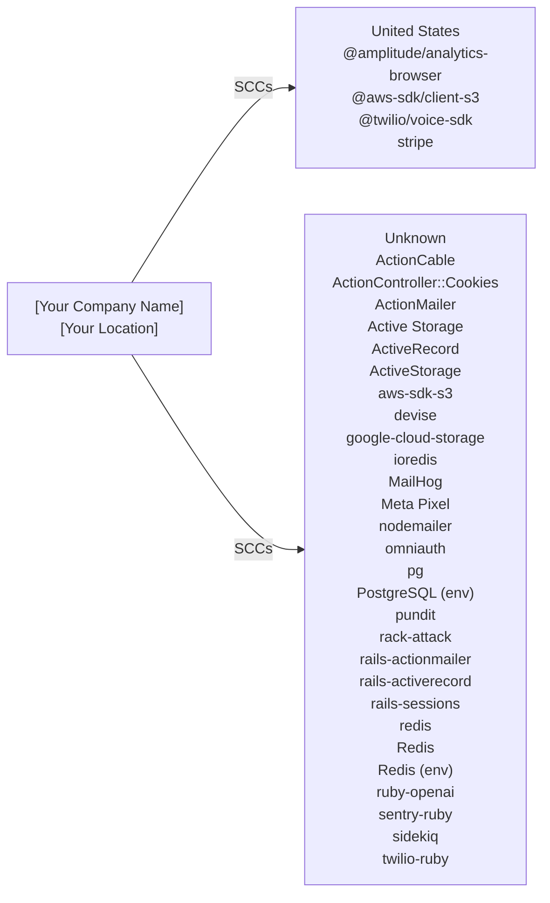

# Cross-Border Data Transfer Map

> **Document Version:** 1.0  
> **Document Owner:** [Your Company Name]  
> **Next Review Date:** 2027-03-16

**Organisation:** [Your Company Name]
**Data Exporter Location:** [Your Location]
**Project:** @chatwoot/chatwoot
**Generated:** 2026-03-16

---

> This document maps all international data transfers identified through code analysis. It identifies the destination country, service provider, data types transferred, and applicable legal safeguards for each transfer. Required under GDPR Chapter V (Articles 44-49) for EU data exporters.

## Transfer Flow Diagram

## Transfer Summary by Country

| Country | Services | Data Types | Safeguard | Adequacy Decision |
|---------|----------|-----------|-----------|-------------------|
| United States (US) | @amplitude/analytics-browser, @aws-sdk/client-s3, @twilio/voice-sdk, stripe | user behavior, device information, session data, uploaded files | SCCs | No |
| Unknown (??) | ActionCable, ActionController::Cookies, ActionMailer, Active Storage, ActiveRecord, ActiveStorage, aws-sdk-s3, devise, google-cloud-storage, ioredis, MailHog, Meta Pixel, nodemailer, omniauth, pg, PostgreSQL (env), pundit, rack-attack, rails-actionmailer, rails-activerecord, rails-sessions, redis, Redis, Redis (env), ruby-openai, sentry-ruby, sidekiq, twilio-ruby | real-time user data, connection metadata, channel subscriptions, WebSocket messages | [Verify with provider] | No |

## Detailed Transfer Register

| # | Service | Category | Country | Data Types | Safeguard | DPF Certified | DPA in Place |
|---|---------|----------|---------|-----------|-----------|---------------|-------------|
| 1 | @amplitude/analytics-browser | analytics | United States | user behavior, device information, session data | SCCs | N/A | [ ] |
| 2 | @aws-sdk/client-s3 | storage | United States | uploaded files, file metadata | EU-US DPF / SCCs | [Verify](https://www.dataprivacyframework.gov/list) | [ ] |
| 3 | @twilio/voice-sdk | other | United States | phone numbers, voice call metadata, call recordings | EU-US DPF / SCCs | [Verify](https://www.dataprivacyframework.gov/list) | [ ] |
| 4 | ActionCable | other | Unknown | real-time user data, connection metadata, channel subscriptions | [Verify with provider] | N/A | [ ] |
| 5 | ActionController::Cookies | other | Unknown | session cookies, session data, CSRF tokens | [Verify with provider] | N/A | [ ] |
| 6 | ActionMailer | email | Unknown | email addresses, email content | [Verify with provider] | N/A | [ ] |
| 7 | Active Storage | storage | Unknown | uploaded files, file metadata, storage service credentials | [Verify with provider] | N/A | [ ] |
| 8 | ActiveRecord | database | Unknown | user data as defined in schema, timestamps, associations | [Verify with provider] | N/A | [ ] |
| 9 | ActiveStorage | storage | Unknown | uploaded files, file metadata, storage references | [Verify with provider] | N/A | [ ] |
| 10 | aws-sdk-s3 | storage | Unknown | uploaded files, file metadata | [Verify with provider] | N/A | [ ] |
| 11 | devise | auth | Unknown | email, password hash, session data | [Verify with provider] | N/A | [ ] |
| 12 | google-cloud-storage | storage | Unknown | uploaded files, file metadata | [Verify with provider] | N/A | [ ] |
| 13 | ioredis | database | Unknown | cached data, session data | [Verify with provider] | N/A | [ ] |
| 14 | MailHog | email | Unknown | email content | [Verify with provider] | N/A | [ ] |
| 15 | Meta Pixel | advertising | Unknown | page views, conversion events, user behavior | [Verify with provider] | N/A | [ ] |
| 16 | nodemailer | email | Unknown | email addresses, email content | [Verify with provider] | N/A | [ ] |
| 17 | omniauth | auth | Unknown | email, name, OAuth tokens | [Verify with provider] | N/A | [ ] |
| 18 | pg | database | Unknown | user data as defined in schema | [Verify with provider] | N/A | [ ] |
| 19 | PostgreSQL (env) | database | Unknown | application data, user records | [Verify with provider] | N/A | [ ] |
| 20 | pundit | auth | Unknown | user roles, authorization policies, access control data | [Verify with provider] | N/A | [ ] |
| 21 | rack-attack | other | Unknown | IP addresses, request metadata | [Verify with provider] | N/A | [ ] |
| 22 | rails-actionmailer | email | Unknown | email addresses, email content | [Verify with provider] | N/A | [ ] |
| 23 | rails-activerecord | database | Unknown | user data as defined in schema | [Verify with provider] | N/A | [ ] |
| 24 | rails-sessions | auth | Unknown | session cookies, CSRF tokens | [Verify with provider] | N/A | [ ] |
| 25 | redis | database | Unknown | cached data, session data | [Verify with provider] | N/A | [ ] |
| 26 | Redis | database | Unknown | session data, cache data | [Verify with provider] | N/A | [ ] |
| 27 | Redis (env) | database | Unknown | session data, cache data | [Verify with provider] | N/A | [ ] |
| 28 | ruby-openai | ai | Unknown | user prompts, conversation history, generated content | [Verify with provider] | N/A | [ ] |
| 29 | sentry-ruby | monitoring | Unknown | error data, stack traces, user context | [Verify with provider] | N/A | [ ] |
| 30 | sidekiq | other | Unknown | job data, user data processed in background jobs | [Verify with provider] | N/A | [ ] |
| 31 | stripe | payment | United States | payment information, billing address, email | EU-US DPF / SCCs | [Verify](https://www.dataprivacyframework.gov/list) | [ ] |
| 32 | twilio-ruby | other | Unknown | phone numbers, SMS message content, voice call metadata | [Verify with provider] | N/A | [ ] |

## Services Requiring Additional Safeguards

The following services transfer data to countries without an EU adequacy decision. Additional safeguards (SCCs + supplementary measures) are required per the Schrems II ruling.

### @amplitude/analytics-browser

- **Destination:** United States
- **Safeguard:** SCCs
- **Data:** user behavior, device information, session data
- **Required actions:**
  - [ ] Execute Standard Contractual Clauses (Module 2: Controller to Processor)
  - [ ] Complete Annex I (List of parties)
  - [ ] Complete Annex II (Technical and organisational measures)
  - [ ] Verify provider's DPF certification status
  - [ ] Implement supplementary encryption measures if needed

### ActionCable

- **Destination:** Unknown
- **Safeguard:** [Verify with provider]
- **Data:** real-time user data, connection metadata, channel subscriptions, WebSocket messages
- **Required actions:**
  - [ ] Execute Standard Contractual Clauses (Module 2: Controller to Processor)
  - [ ] Complete Annex I (List of parties)
  - [ ] Complete Annex II (Technical and organisational measures)
  - [ ] Verify provider's DPF certification status
  - [ ] Implement supplementary encryption measures if needed

### ActionController::Cookies

- **Destination:** Unknown
- **Safeguard:** [Verify with provider]
- **Data:** session cookies, session data, CSRF tokens
- **Required actions:**
  - [ ] Execute Standard Contractual Clauses (Module 2: Controller to Processor)
  - [ ] Complete Annex I (List of parties)
  - [ ] Complete Annex II (Technical and organisational measures)
  - [ ] Verify provider's DPF certification status
  - [ ] Implement supplementary encryption measures if needed

### ActionMailer

- **Destination:** Unknown
- **Safeguard:** [Verify with provider]
- **Data:** email addresses, email content
- **Required actions:**
  - [ ] Execute Standard Contractual Clauses (Module 2: Controller to Processor)
  - [ ] Complete Annex I (List of parties)
  - [ ] Complete Annex II (Technical and organisational measures)
  - [ ] Verify provider's DPF certification status
  - [ ] Implement supplementary encryption measures if needed

### Active Storage

- **Destination:** Unknown
- **Safeguard:** [Verify with provider]
- **Data:** uploaded files, file metadata, storage service credentials, potential PII in uploaded content
- **Required actions:**
  - [ ] Execute Standard Contractual Clauses (Module 2: Controller to Processor)
  - [ ] Complete Annex I (List of parties)
  - [ ] Complete Annex II (Technical and organisational measures)
  - [ ] Verify provider's DPF certification status
  - [ ] Implement supplementary encryption measures if needed

### ActiveRecord

- **Destination:** Unknown
- **Safeguard:** [Verify with provider]
- **Data:** user data as defined in schema, timestamps, associations
- **Required actions:**
  - [ ] Execute Standard Contractual Clauses (Module 2: Controller to Processor)
  - [ ] Complete Annex I (List of parties)
  - [ ] Complete Annex II (Technical and organisational measures)
  - [ ] Verify provider's DPF certification status
  - [ ] Implement supplementary encryption measures if needed

### ActiveStorage

- **Destination:** Unknown
- **Safeguard:** [Verify with provider]
- **Data:** uploaded files, file metadata, storage references
- **Required actions:**
  - [ ] Execute Standard Contractual Clauses (Module 2: Controller to Processor)
  - [ ] Complete Annex I (List of parties)
  - [ ] Complete Annex II (Technical and organisational measures)
  - [ ] Verify provider's DPF certification status
  - [ ] Implement supplementary encryption measures if needed

### aws-sdk-s3

- **Destination:** Unknown
- **Safeguard:** [Verify with provider]
- **Data:** uploaded files, file metadata
- **Required actions:**
  - [ ] Execute Standard Contractual Clauses (Module 2: Controller to Processor)
  - [ ] Complete Annex I (List of parties)
  - [ ] Complete Annex II (Technical and organisational measures)
  - [ ] Verify provider's DPF certification status
  - [ ] Implement supplementary encryption measures if needed

### devise

- **Destination:** Unknown
- **Safeguard:** [Verify with provider]
- **Data:** email, password hash, session data, authentication tokens
- **Required actions:**
  - [ ] Execute Standard Contractual Clauses (Module 2: Controller to Processor)
  - [ ] Complete Annex I (List of parties)
  - [ ] Complete Annex II (Technical and organisational measures)
  - [ ] Verify provider's DPF certification status
  - [ ] Implement supplementary encryption measures if needed

### google-cloud-storage

- **Destination:** Unknown
- **Safeguard:** [Verify with provider]
- **Data:** uploaded files, file metadata
- **Required actions:**
  - [ ] Execute Standard Contractual Clauses (Module 2: Controller to Processor)
  - [ ] Complete Annex I (List of parties)
  - [ ] Complete Annex II (Technical and organisational measures)
  - [ ] Verify provider's DPF certification status
  - [ ] Implement supplementary encryption measures if needed

### ioredis

- **Destination:** Unknown
- **Safeguard:** [Verify with provider]
- **Data:** cached data, session data
- **Required actions:**
  - [ ] Execute Standard Contractual Clauses (Module 2: Controller to Processor)
  - [ ] Complete Annex I (List of parties)
  - [ ] Complete Annex II (Technical and organisational measures)
  - [ ] Verify provider's DPF certification status
  - [ ] Implement supplementary encryption measures if needed

### MailHog

- **Destination:** Unknown
- **Safeguard:** [Verify with provider]
- **Data:** email content
- **Required actions:**
  - [ ] Execute Standard Contractual Clauses (Module 2: Controller to Processor)
  - [ ] Complete Annex I (List of parties)
  - [ ] Complete Annex II (Technical and organisational measures)
  - [ ] Verify provider's DPF certification status
  - [ ] Implement supplementary encryption measures if needed

### Meta Pixel

- **Destination:** Unknown
- **Safeguard:** [Verify with provider]
- **Data:** page views, conversion events, user behavior, device information
- **Required actions:**
  - [ ] Execute Standard Contractual Clauses (Module 2: Controller to Processor)
  - [ ] Complete Annex I (List of parties)
  - [ ] Complete Annex II (Technical and organisational measures)
  - [ ] Verify provider's DPF certification status
  - [ ] Implement supplementary encryption measures if needed

### nodemailer

- **Destination:** Unknown
- **Safeguard:** [Verify with provider]
- **Data:** email addresses, email content
- **Required actions:**
  - [ ] Execute Standard Contractual Clauses (Module 2: Controller to Processor)
  - [ ] Complete Annex I (List of parties)
  - [ ] Complete Annex II (Technical and organisational measures)
  - [ ] Verify provider's DPF certification status
  - [ ] Implement supplementary encryption measures if needed

### omniauth

- **Destination:** Unknown
- **Safeguard:** [Verify with provider]
- **Data:** email, name, OAuth tokens, profile data
- **Required actions:**
  - [ ] Execute Standard Contractual Clauses (Module 2: Controller to Processor)
  - [ ] Complete Annex I (List of parties)
  - [ ] Complete Annex II (Technical and organisational measures)
  - [ ] Verify provider's DPF certification status
  - [ ] Implement supplementary encryption measures if needed

### pg

- **Destination:** Unknown
- **Safeguard:** [Verify with provider]
- **Data:** user data as defined in schema
- **Required actions:**
  - [ ] Execute Standard Contractual Clauses (Module 2: Controller to Processor)
  - [ ] Complete Annex I (List of parties)
  - [ ] Complete Annex II (Technical and organisational measures)
  - [ ] Verify provider's DPF certification status
  - [ ] Implement supplementary encryption measures if needed

### PostgreSQL (env)

- **Destination:** Unknown
- **Safeguard:** [Verify with provider]
- **Data:** application data, user records
- **Required actions:**
  - [ ] Execute Standard Contractual Clauses (Module 2: Controller to Processor)
  - [ ] Complete Annex I (List of parties)
  - [ ] Complete Annex II (Technical and organisational measures)
  - [ ] Verify provider's DPF certification status
  - [ ] Implement supplementary encryption measures if needed

### pundit

- **Destination:** Unknown
- **Safeguard:** [Verify with provider]
- **Data:** user roles, authorization policies, access control data
- **Required actions:**
  - [ ] Execute Standard Contractual Clauses (Module 2: Controller to Processor)
  - [ ] Complete Annex I (List of parties)
  - [ ] Complete Annex II (Technical and organisational measures)
  - [ ] Verify provider's DPF certification status
  - [ ] Implement supplementary encryption measures if needed

### rack-attack

- **Destination:** Unknown
- **Safeguard:** [Verify with provider]
- **Data:** IP addresses, request metadata
- **Required actions:**
  - [ ] Execute Standard Contractual Clauses (Module 2: Controller to Processor)
  - [ ] Complete Annex I (List of parties)
  - [ ] Complete Annex II (Technical and organisational measures)
  - [ ] Verify provider's DPF certification status
  - [ ] Implement supplementary encryption measures if needed

### rails-actionmailer

- **Destination:** Unknown
- **Safeguard:** [Verify with provider]
- **Data:** email addresses, email content
- **Required actions:**
  - [ ] Execute Standard Contractual Clauses (Module 2: Controller to Processor)
  - [ ] Complete Annex I (List of parties)
  - [ ] Complete Annex II (Technical and organisational measures)
  - [ ] Verify provider's DPF certification status
  - [ ] Implement supplementary encryption measures if needed

### rails-activerecord

- **Destination:** Unknown
- **Safeguard:** [Verify with provider]
- **Data:** user data as defined in schema
- **Required actions:**
  - [ ] Execute Standard Contractual Clauses (Module 2: Controller to Processor)
  - [ ] Complete Annex I (List of parties)
  - [ ] Complete Annex II (Technical and organisational measures)
  - [ ] Verify provider's DPF certification status
  - [ ] Implement supplementary encryption measures if needed

### rails-sessions

- **Destination:** Unknown
- **Safeguard:** [Verify with provider]
- **Data:** session cookies, CSRF tokens
- **Required actions:**
  - [ ] Execute Standard Contractual Clauses (Module 2: Controller to Processor)
  - [ ] Complete Annex I (List of parties)
  - [ ] Complete Annex II (Technical and organisational measures)
  - [ ] Verify provider's DPF certification status
  - [ ] Implement supplementary encryption measures if needed

### redis

- **Destination:** Unknown
- **Safeguard:** [Verify with provider]
- **Data:** cached data, session data
- **Required actions:**
  - [ ] Execute Standard Contractual Clauses (Module 2: Controller to Processor)
  - [ ] Complete Annex I (List of parties)
  - [ ] Complete Annex II (Technical and organisational measures)
  - [ ] Verify provider's DPF certification status
  - [ ] Implement supplementary encryption measures if needed

### Redis

- **Destination:** Unknown
- **Safeguard:** [Verify with provider]
- **Data:** session data, cache data
- **Required actions:**
  - [ ] Execute Standard Contractual Clauses (Module 2: Controller to Processor)
  - [ ] Complete Annex I (List of parties)
  - [ ] Complete Annex II (Technical and organisational measures)
  - [ ] Verify provider's DPF certification status
  - [ ] Implement supplementary encryption measures if needed

### Redis (env)

- **Destination:** Unknown
- **Safeguard:** [Verify with provider]
- **Data:** session data, cache data
- **Required actions:**
  - [ ] Execute Standard Contractual Clauses (Module 2: Controller to Processor)
  - [ ] Complete Annex I (List of parties)
  - [ ] Complete Annex II (Technical and organisational measures)
  - [ ] Verify provider's DPF certification status
  - [ ] Implement supplementary encryption measures if needed

### ruby-openai

- **Destination:** Unknown
- **Safeguard:** [Verify with provider]
- **Data:** user prompts, conversation history, generated content
- **Required actions:**
  - [ ] Execute Standard Contractual Clauses (Module 2: Controller to Processor)
  - [ ] Complete Annex I (List of parties)
  - [ ] Complete Annex II (Technical and organisational measures)
  - [ ] Verify provider's DPF certification status
  - [ ] Implement supplementary encryption measures if needed

### sentry-ruby

- **Destination:** Unknown
- **Safeguard:** [Verify with provider]
- **Data:** error data, stack traces, user context, device information
- **Required actions:**
  - [ ] Execute Standard Contractual Clauses (Module 2: Controller to Processor)
  - [ ] Complete Annex I (List of parties)
  - [ ] Complete Annex II (Technical and organisational measures)
  - [ ] Verify provider's DPF certification status
  - [ ] Implement supplementary encryption measures if needed

### sidekiq

- **Destination:** Unknown
- **Safeguard:** [Verify with provider]
- **Data:** job data, user data processed in background jobs
- **Required actions:**
  - [ ] Execute Standard Contractual Clauses (Module 2: Controller to Processor)
  - [ ] Complete Annex I (List of parties)
  - [ ] Complete Annex II (Technical and organisational measures)
  - [ ] Verify provider's DPF certification status
  - [ ] Implement supplementary encryption measures if needed

### twilio-ruby

- **Destination:** Unknown
- **Safeguard:** [Verify with provider]
- **Data:** phone numbers, SMS message content, voice call metadata
- **Required actions:**
  - [ ] Execute Standard Contractual Clauses (Module 2: Controller to Processor)
  - [ ] Complete Annex I (List of parties)
  - [ ] Complete Annex II (Technical and organisational measures)
  - [ ] Verify provider's DPF certification status
  - [ ] Implement supplementary encryption measures if needed

## Data Type × Service Matrix

| Data Type | @amplitude/analytics-browser | @aws-sdk/client-s3 | @twilio/voice-sdk | ActionCable | ActionController::Cookies | ActionMailer | Active Storage | ActiveRecord | ActiveStorage | aws-sdk-s3 | devise | google-cloud-storage | ioredis | MailHog | Meta Pixel | nodemailer | omniauth | pg | PostgreSQL (env) | pundit | rack-attack | rails-actionmailer | rails-activerecord | rails-sessions | redis | Redis | Redis (env) | ruby-openai | sentry-ruby | sidekiq | stripe | twilio-ruby |
| --- | --- | --- | --- | --- | --- | --- | --- | --- | --- | --- | --- | --- | --- | --- | --- | --- | --- | --- | --- | --- | --- | --- | --- | --- | --- | --- | --- | --- | --- | --- | --- | --- |
| user behavior | ● | — | — | — | — | — | — | — | — | — | — | — | — | — | ● | — | — | — | — | — | — | — | — | — | — | — | — | — | — | — | — | — |
| device information | ● | — | ● | — | — | — | — | — | — | — | — | — | — | — | ● | — | — | — | — | — | — | — | — | — | — | — | — | — | ● | — | — | — |
| session data | ● | — | — | — | ● | — | — | — | — | — | ● | — | ● | — | — | — | — | — | — | — | — | — | — | — | ● | ● | ● | — | — | — | — | — |
| uploaded files | — | ● | — | — | — | — | ● | — | ● | ● | — | ● | — | — | — | — | — | — | — | — | — | — | — | — | — | — | — | — | — | — | — | — |
| file metadata | — | ● | — | — | — | — | ● | — | ● | ● | — | ● | — | — | — | — | — | — | — | — | — | — | — | — | — | — | — | — | — | — | — | — |
| phone numbers | — | — | ● | — | — | — | — | — | — | — | — | — | — | — | — | — | — | — | — | — | — | — | — | — | — | — | — | — | — | — | — | ● |
| voice call metadata | — | — | ● | — | — | — | — | — | — | — | — | — | — | — | — | — | — | — | — | — | — | — | — | — | — | — | — | — | — | — | — | ● |
| call recordings | — | — | ● | — | — | — | — | — | — | — | — | — | — | — | — | — | — | — | — | — | — | — | — | — | — | — | — | — | — | — | — | — |
| real-time user data | — | — | — | ● | — | — | — | — | — | — | — | — | — | — | — | — | — | — | — | — | — | — | — | — | — | — | — | — | — | — | — | — |
| connection metadata | — | — | — | ● | — | — | — | — | — | — | — | — | — | — | — | — | — | — | — | — | — | — | — | — | — | — | — | — | — | — | — | — |
| channel subscriptions | — | — | — | ● | — | — | — | — | — | — | — | — | — | — | — | — | — | — | — | — | — | — | — | — | — | — | — | — | — | — | — | — |
| WebSocket messages | — | — | — | ● | — | — | — | — | — | — | — | — | — | — | — | — | — | — | — | — | — | — | — | — | — | — | — | — | — | — | — | — |
| session cookies | — | — | — | — | ● | — | — | — | — | — | — | — | — | — | — | — | — | — | — | — | — | — | — | ● | — | — | — | — | — | — | — | — |
| CSRF tokens | — | — | — | — | ● | — | — | — | — | — | — | — | — | — | — | — | — | — | — | — | — | — | — | ● | — | — | — | — | — | — | — | — |
| email addresses | — | — | — | — | — | ● | — | — | — | — | — | — | — | — | — | ● | — | — | — | — | — | ● | — | — | — | — | — | — | — | — | — | — |
| email content | — | — | — | — | — | ● | — | — | — | — | — | — | — | ● | — | ● | — | — | — | — | — | ● | — | — | — | — | — | — | — | — | — | — |
| storage service credentials | — | — | — | — | — | — | ● | — | — | — | — | — | — | — | — | — | — | — | — | — | — | — | — | — | — | — | — | — | — | — | — | — |
| potential PII in uploaded content | — | — | — | — | — | — | ● | — | — | — | — | — | — | — | — | — | — | — | — | — | — | — | — | — | — | — | — | — | — | — | — | — |
| user data as defined in schema | — | — | — | — | — | — | — | ● | — | — | — | — | — | — | — | — | — | ● | — | — | — | — | ● | — | — | — | — | — | — | — | — | — |
| timestamps | — | — | — | — | — | — | — | ● | — | — | — | — | — | — | — | — | — | — | — | — | — | — | — | — | — | — | — | — | — | — | — | — |
| associations | — | — | — | — | — | — | — | ● | — | — | — | — | — | — | — | — | — | — | — | — | — | — | — | — | — | — | — | — | — | — | — | — |
| storage references | — | — | — | — | — | — | — | — | ● | — | — | — | — | — | — | — | — | — | — | — | — | — | — | — | — | — | — | — | — | — | — | — |
| email | — | — | — | — | — | — | — | — | — | — | ● | — | — | — | — | — | ● | — | — | — | — | — | — | — | — | — | — | — | — | — | ● | — |
| password hash | — | — | — | — | — | — | — | — | — | — | ● | — | — | — | — | — | — | — | — | — | — | — | — | — | — | — | — | — | — | — | — | — |
| authentication tokens | — | — | — | — | — | — | — | — | — | — | ● | — | — | — | — | — | — | — | — | — | — | — | — | — | — | — | — | — | — | — | — | — |
| cached data | — | — | — | — | — | — | — | — | — | — | — | — | ● | — | — | — | — | — | — | — | — | — | — | — | ● | — | — | — | — | — | — | — |
| page views | — | — | — | — | — | — | — | — | — | — | — | — | — | — | ● | — | — | — | — | — | — | — | — | — | — | — | — | — | — | — | — | — |
| conversion events | — | — | — | — | — | — | — | — | — | — | — | — | — | — | ● | — | — | — | — | — | — | — | — | — | — | — | — | — | — | — | — | — |
| name | — | — | — | — | — | — | — | — | — | — | — | — | — | — | — | — | ● | — | — | — | — | — | — | — | — | — | — | — | — | — | — | — |
| OAuth tokens | — | — | — | — | — | — | — | — | — | — | — | — | — | — | — | — | ● | — | — | — | — | — | — | — | — | — | — | — | — | — | — | — |
| profile data | — | — | — | — | — | — | — | — | — | — | — | — | — | — | — | — | ● | — | — | — | — | — | — | — | — | — | — | — | — | — | — | — |
| application data | — | — | — | — | — | — | — | — | — | — | — | — | — | — | — | — | — | — | ● | — | — | — | — | — | — | — | — | — | — | — | — | — |
| user records | — | — | — | — | — | — | — | — | — | — | — | — | — | — | — | — | — | — | ● | — | — | — | — | — | — | — | — | — | — | — | — | — |
| user roles | — | — | — | — | — | — | — | — | — | — | — | — | — | — | — | — | — | — | — | ● | — | — | — | — | — | — | — | — | — | — | — | — |
| authorization policies | — | — | — | — | — | — | — | — | — | — | — | — | — | — | — | — | — | — | — | ● | — | — | — | — | — | — | — | — | — | — | — | — |
| access control data | — | — | — | — | — | — | — | — | — | — | — | — | — | — | — | — | — | — | — | ● | — | — | — | — | — | — | — | — | — | — | — | — |
| IP addresses | — | — | — | — | — | — | — | — | — | — | — | — | — | — | — | — | — | — | — | — | ● | — | — | — | — | — | — | — | — | — | — | — |
| request metadata | — | — | — | — | — | — | — | — | — | — | — | — | — | — | — | — | — | — | — | — | ● | — | — | — | — | — | — | — | — | — | — | — |
| cache data | — | — | — | — | — | — | — | — | — | — | — | — | — | — | — | — | — | — | — | — | — | — | — | — | — | ● | ● | — | — | — | — | — |
| user prompts | — | — | — | — | — | — | — | — | — | — | — | — | — | — | — | — | — | — | — | — | — | — | — | — | — | — | — | ● | — | — | — | — |
| conversation history | — | — | — | — | — | — | — | — | — | — | — | — | — | — | — | — | — | — | — | — | — | — | — | — | — | — | — | ● | — | — | — | — |
| generated content | — | — | — | — | — | — | — | — | — | — | — | — | — | — | — | — | — | — | — | — | — | — | — | — | — | — | — | ● | — | — | — | — |
| error data | — | — | — | — | — | — | — | — | — | — | — | — | — | — | — | — | — | — | — | — | — | — | — | — | — | — | — | — | ● | — | — | — |
| stack traces | — | — | — | — | — | — | — | — | — | — | — | — | — | — | — | — | — | — | — | — | — | — | — | — | — | — | — | — | ● | — | — | — |
| user context | — | — | — | — | — | — | — | — | — | — | — | — | — | — | — | — | — | — | — | — | — | — | — | — | — | — | — | — | ● | — | — | — |
| job data | — | — | — | — | — | — | — | — | — | — | — | — | — | — | — | — | — | — | — | — | — | — | — | — | — | — | — | — | — | ● | — | — |
| user data processed in background jobs | — | — | — | — | — | — | — | — | — | — | — | — | — | — | — | — | — | — | — | — | — | — | — | — | — | — | — | — | — | ● | — | — |
| payment information | — | — | — | — | — | — | — | — | — | — | — | — | — | — | — | — | — | — | — | — | — | — | — | — | — | — | — | — | — | — | ● | — |
| billing address | — | — | — | — | — | — | — | — | — | — | — | — | — | — | — | — | — | — | — | — | — | — | — | — | — | — | — | — | — | — | ● | — |
| transaction history | — | — | — | — | — | — | — | — | — | — | — | — | — | — | — | — | — | — | — | — | — | — | — | — | — | — | — | — | — | — | ● | — |
| SMS message content | — | — | — | — | — | — | — | — | — | — | — | — | — | — | — | — | — | — | — | — | — | — | — | — | — | — | — | — | — | — | — | ● |

## Transfer Compliance Checklist

- [ ] All transfers have a valid legal basis under GDPR Chapter V
- [ ] SCCs (2021 version) executed with all non-DPF-certified providers
- [ ] DPF certification verified for applicable US providers
- [ ] Transfer Impact Assessment completed for each non-adequate country
- [ ] Supplementary measures implemented where SCCs are relied upon
- [ ] Data Processing Agreements in place with all processors
- [ ] Record of Processing Activities updated with transfer details
- [ ] Privacy Policy discloses international transfers and safeguards
- [ ] DPO informed of all cross-border transfers

## Review Schedule

| Review | Frequency | Next Due |
|--------|-----------|----------|
| Full transfer map review | Annual | 2027-03-16 |
| DPF certification verification | Semi-annual | [Set date] |
| New service onboarding review | Per event | Ongoing |
| Regulatory change assessment | Quarterly | [Set date] |

**Contact:** [your-email@example.com]

---

*This Cross-Border Transfer Map was auto-generated by [Codepliant](https://github.com/joechensmartz/codepliant) based on code analysis. Service location and DPF certification status should be verified with each provider's current documentation. This document does not constitute legal advice.*
