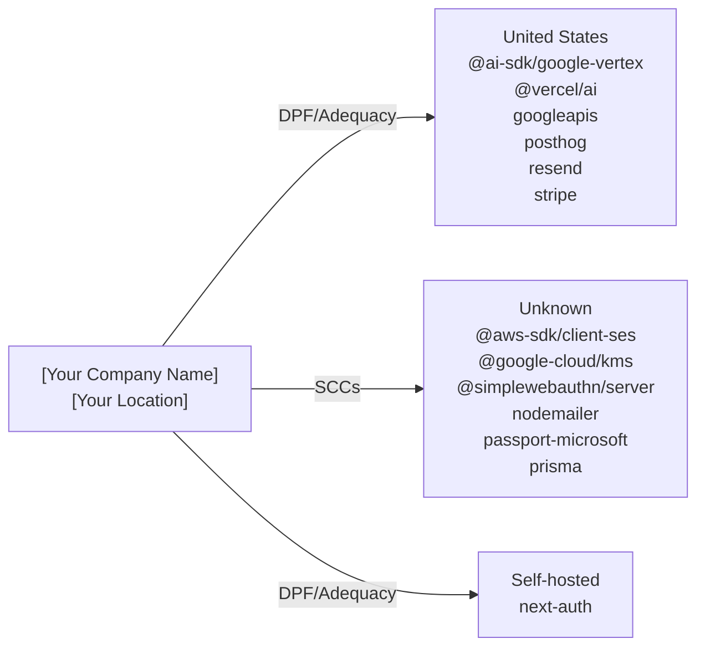

# Cross-Border Data Transfer Map

> **Document Version:** 1.0  
> **Document Owner:** [Your Company Name]  
> **Next Review Date:** 2027-03-16

**Organisation:** [Your Company Name]
**Data Exporter Location:** [Your Location]
**Project:** @documenso/root
**Generated:** 2026-03-16

---

> This document maps all international data transfers identified through code analysis. It identifies the destination country, service provider, data types transferred, and applicable legal safeguards for each transfer. Required under GDPR Chapter V (Articles 44-49) for EU data exporters.

## Transfer Flow Diagram

## Transfer Summary by Country

| Country | Services | Data Types | Safeguard | Adequacy Decision |
|---------|----------|-----------|-----------|-------------------|
| United States (US) | @ai-sdk/google-vertex, @vercel/ai, googleapis, posthog, resend, stripe | user prompts, conversation history, generated content, user data via Google APIs | EU-US DPF / SCCs | Yes |
| Unknown (??) | @aws-sdk/client-ses, @google-cloud/kms, @simplewebauthn/server, nodemailer, passport-microsoft, prisma | email addresses, email content, uploaded files, file metadata | [Verify with provider] | No |
| Self-hosted (—) | next-auth | email, name, profile picture, OAuth tokens | No third-party transfer | Yes |

## Detailed Transfer Register

| # | Service | Category | Country | Data Types | Safeguard | DPF Certified | DPA in Place |
|---|---------|----------|---------|-----------|-----------|---------------|-------------|
| 1 | @ai-sdk/google-vertex | ai | United States | user prompts, conversation history, generated content | EU-US DPF / SCCs | [Verify](https://www.dataprivacyframework.gov/list) | [ ] |
| 2 | @aws-sdk/client-ses | email | Unknown | email addresses, email content, uploaded files | [Verify with provider] | N/A | [ ] |
| 3 | @google-cloud/kms | other | Unknown | encryption keys, key metadata | [Verify with provider] | N/A | [ ] |
| 4 | @simplewebauthn/server | auth | Unknown | biometric authentication data, device attestation, credential IDs | [Verify with provider] | N/A | [ ] |
| 5 | @vercel/ai | ai | United States | user prompts, conversation history, generated content | SCCs | N/A | [ ] |
| 6 | googleapis | other | United States | user data via Google APIs, calendar data, email data | EU-US DPF / SCCs | [Verify](https://www.dataprivacyframework.gov/list) | [ ] |
| 7 | next-auth | auth | Self-hosted | email, name, profile picture | No third-party transfer | [Verify](https://www.dataprivacyframework.gov/list) | [ ] |
| 8 | nodemailer | email | Unknown | email addresses, email content | [Verify with provider] | N/A | [ ] |
| 9 | passport-microsoft | auth | Unknown | email, name, Microsoft profile data | [Verify with provider] | N/A | [ ] |
| 10 | posthog | analytics | United States | user behavior, session recordings, feature flag usage | SCCs | N/A | [ ] |
| 11 | prisma | database | Unknown | user data as defined in schema | [Verify with provider] | N/A | [ ] |
| 12 | resend | email | United States | email addresses, email content | SCCs | N/A | [ ] |
| 13 | stripe | payment | United States | payment information, billing address, email | EU-US DPF / SCCs | [Verify](https://www.dataprivacyframework.gov/list) | [ ] |

## Services Requiring Additional Safeguards

The following services transfer data to countries without an EU adequacy decision. Additional safeguards (SCCs + supplementary measures) are required per the Schrems II ruling.

### @aws-sdk/client-ses

- **Destination:** Unknown
- **Safeguard:** [Verify with provider]
- **Data:** email addresses, email content, uploaded files, file metadata
- **Required actions:**
  - [ ] Execute Standard Contractual Clauses (Module 2: Controller to Processor)
  - [ ] Complete Annex I (List of parties)
  - [ ] Complete Annex II (Technical and organisational measures)
  - [ ] Verify provider's DPF certification status
  - [ ] Implement supplementary encryption measures if needed

### @google-cloud/kms

- **Destination:** Unknown
- **Safeguard:** [Verify with provider]
- **Data:** encryption keys, key metadata
- **Required actions:**
  - [ ] Execute Standard Contractual Clauses (Module 2: Controller to Processor)
  - [ ] Complete Annex I (List of parties)
  - [ ] Complete Annex II (Technical and organisational measures)
  - [ ] Verify provider's DPF certification status
  - [ ] Implement supplementary encryption measures if needed

### @simplewebauthn/server

- **Destination:** Unknown
- **Safeguard:** [Verify with provider]
- **Data:** biometric authentication data, device attestation, credential IDs
- **Required actions:**
  - [ ] Execute Standard Contractual Clauses (Module 2: Controller to Processor)
  - [ ] Complete Annex I (List of parties)
  - [ ] Complete Annex II (Technical and organisational measures)
  - [ ] Verify provider's DPF certification status
  - [ ] Implement supplementary encryption measures if needed

### @vercel/ai

- **Destination:** United States
- **Safeguard:** SCCs
- **Data:** user prompts, conversation history, generated content
- **Required actions:**
  - [ ] Execute Standard Contractual Clauses (Module 2: Controller to Processor)
  - [ ] Complete Annex I (List of parties)
  - [ ] Complete Annex II (Technical and organisational measures)
  - [ ] Verify provider's DPF certification status
  - [ ] Implement supplementary encryption measures if needed

### nodemailer

- **Destination:** Unknown
- **Safeguard:** [Verify with provider]
- **Data:** email addresses, email content
- **Required actions:**
  - [ ] Execute Standard Contractual Clauses (Module 2: Controller to Processor)
  - [ ] Complete Annex I (List of parties)
  - [ ] Complete Annex II (Technical and organisational measures)
  - [ ] Verify provider's DPF certification status
  - [ ] Implement supplementary encryption measures if needed

### passport-microsoft

- **Destination:** Unknown
- **Safeguard:** [Verify with provider]
- **Data:** email, name, Microsoft profile data, OAuth tokens
- **Required actions:**
  - [ ] Execute Standard Contractual Clauses (Module 2: Controller to Processor)
  - [ ] Complete Annex I (List of parties)
  - [ ] Complete Annex II (Technical and organisational measures)
  - [ ] Verify provider's DPF certification status
  - [ ] Implement supplementary encryption measures if needed

### posthog

- **Destination:** United States
- **Safeguard:** SCCs
- **Data:** user behavior, session recordings, feature flag usage, device information
- **Required actions:**
  - [ ] Execute Standard Contractual Clauses (Module 2: Controller to Processor)
  - [ ] Complete Annex I (List of parties)
  - [ ] Complete Annex II (Technical and organisational measures)
  - [ ] Verify provider's DPF certification status
  - [ ] Implement supplementary encryption measures if needed

### prisma

- **Destination:** Unknown
- **Safeguard:** [Verify with provider]
- **Data:** user data as defined in schema
- **Required actions:**
  - [ ] Execute Standard Contractual Clauses (Module 2: Controller to Processor)
  - [ ] Complete Annex I (List of parties)
  - [ ] Complete Annex II (Technical and organisational measures)
  - [ ] Verify provider's DPF certification status
  - [ ] Implement supplementary encryption measures if needed

### resend

- **Destination:** United States
- **Safeguard:** SCCs
- **Data:** email addresses, email content
- **Required actions:**
  - [ ] Execute Standard Contractual Clauses (Module 2: Controller to Processor)
  - [ ] Complete Annex I (List of parties)
  - [ ] Complete Annex II (Technical and organisational measures)
  - [ ] Verify provider's DPF certification status
  - [ ] Implement supplementary encryption measures if needed

## Data Type × Service Matrix

| Data Type | @ai-sdk/google-vertex | @aws-sdk/client-ses | @google-cloud/kms | @simplewebauthn/server | @vercel/ai | googleapis | next-auth | nodemailer | passport-microsoft | posthog | prisma | resend | stripe |
| --- | --- | --- | --- | --- | --- | --- | --- | --- | --- | --- | --- | --- | --- |
| user prompts | ● | — | — | — | ● | — | — | — | — | — | — | — | — |
| conversation history | ● | — | — | — | ● | — | — | — | — | — | — | — | — |
| generated content | ● | — | — | — | ● | — | — | — | — | — | — | — | — |
| email addresses | — | ● | — | — | — | — | — | ● | — | — | — | ● | — |
| email content | — | ● | — | — | — | — | — | ● | — | — | — | ● | — |
| uploaded files | — | ● | — | — | — | — | — | — | — | — | — | — | — |
| file metadata | — | ● | — | — | — | — | — | — | — | — | — | — | — |
| encryption keys | — | — | ● | — | — | — | — | — | — | — | — | — | — |
| key metadata | — | — | ● | — | — | — | — | — | — | — | — | — | — |
| biometric authentication data | — | — | — | ● | — | — | — | — | — | — | — | — | — |
| device attestation | — | — | — | ● | — | — | — | — | — | — | — | — | — |
| credential IDs | — | — | — | ● | — | — | — | — | — | — | — | — | — |
| user data via Google APIs | — | — | — | — | — | ● | — | — | — | — | — | — | — |
| calendar data | — | — | — | — | — | ● | — | — | — | — | — | — | — |
| email data | — | — | — | — | — | ● | — | — | — | — | — | — | — |
| profile information | — | — | — | — | — | ● | — | — | — | — | — | — | — |
| email | — | — | — | — | — | — | ● | — | ● | — | — | — | ● |
| name | — | — | — | — | — | — | ● | — | ● | — | — | — | — |
| profile picture | — | — | — | — | — | — | ● | — | — | — | — | — | — |
| OAuth tokens | — | — | — | — | — | — | ● | — | ● | — | — | — | — |
| session data | — | — | — | — | — | — | ● | — | — | — | — | — | — |
| Microsoft profile data | — | — | — | — | — | — | — | — | ● | — | — | — | — |
| user behavior | — | — | — | — | — | — | — | — | — | ● | — | — | — |
| session recordings | — | — | — | — | — | — | — | — | — | ● | — | — | — |
| feature flag usage | — | — | — | — | — | — | — | — | — | ● | — | — | — |
| device information | — | — | — | — | — | — | — | — | — | ● | — | — | — |
| user data as defined in schema | — | — | — | — | — | — | — | — | — | — | ● | — | — |
| payment information | — | — | — | — | — | — | — | — | — | — | — | — | ● |
| billing address | — | — | — | — | — | — | — | — | — | — | — | — | ● |
| transaction history | — | — | — | — | — | — | — | — | — | — | — | — | ● |

## Transfer Compliance Checklist

- [ ] All transfers have a valid legal basis under GDPR Chapter V
- [ ] SCCs (2021 version) executed with all non-DPF-certified providers
- [ ] DPF certification verified for applicable US providers
- [ ] Transfer Impact Assessment completed for each non-adequate country
- [ ] Supplementary measures implemented where SCCs are relied upon
- [ ] Data Processing Agreements in place with all processors
- [ ] Record of Processing Activities updated with transfer details
- [ ] Privacy Policy discloses international transfers and safeguards
- [ ] DPO informed of all cross-border transfers

## Review Schedule

| Review | Frequency | Next Due |
|--------|-----------|----------|
| Full transfer map review | Annual | 2027-03-16 |
| DPF certification verification | Semi-annual | [Set date] |
| New service onboarding review | Per event | Ongoing |
| Regulatory change assessment | Quarterly | [Set date] |

**Contact:** [your-email@example.com]

---

*This Cross-Border Transfer Map was auto-generated by [Codepliant](https://github.com/joechensmartz/codepliant) based on code analysis. Service location and DPF certification status should be verified with each provider's current documentation. This document does not constitute legal advice.*
