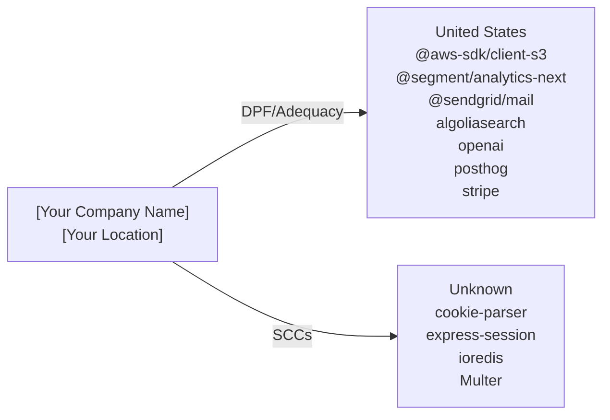

# Cross-Border Data Transfer Map

> **Document Version:** 1.0  
> **Document Owner:** [Your Company Name]  
> **Next Review Date:** 2027-03-16

**Organisation:** [Your Company Name]
**Data Exporter Location:** [Your Location]
**Project:** root
**Generated:** 2026-03-16

---

> This document maps all international data transfers identified through code analysis. It identifies the destination country, service provider, data types transferred, and applicable legal safeguards for each transfer. Required under GDPR Chapter V (Articles 44-49) for EU data exporters.

## Transfer Flow Diagram

## Transfer Summary by Country

| Country | Services | Data Types | Safeguard | Adequacy Decision |
|---------|----------|-----------|-----------|-------------------|
| United States (US) | @aws-sdk/client-s3, @segment/analytics-next, @sendgrid/mail, algoliasearch, openai, posthog, stripe | uploaded files, file metadata, user identity, user behavior | EU-US DPF / SCCs | Yes |
| Unknown (??) | cookie-parser, express-session, ioredis, Multer | cookies, cookie data, session cookies, session data | [Verify with provider] | No |

## Detailed Transfer Register

| # | Service | Category | Country | Data Types | Safeguard | DPF Certified | DPA in Place |
|---|---------|----------|---------|-----------|-----------|---------------|-------------|
| 1 | @aws-sdk/client-s3 | storage | United States | uploaded files, file metadata | EU-US DPF / SCCs | [Verify](https://www.dataprivacyframework.gov/list) | [ ] |
| 2 | @segment/analytics-next | analytics | United States | user identity, user behavior, page views | SCCs | N/A | [ ] |
| 3 | @sendgrid/mail | email | United States | email addresses, email content | EU-US DPF / SCCs | [Verify](https://www.dataprivacyframework.gov/list) | [ ] |
| 4 | algoliasearch | other | United States | search queries, search result clicks, user search behavior | SCCs | N/A | [ ] |
| 5 | cookie-parser | other | Unknown | cookies, cookie data | [Verify with provider] | N/A | [ ] |
| 6 | express-session | other | Unknown | session cookies, session data | [Verify with provider] | N/A | [ ] |
| 7 | ioredis | database | Unknown | cached data, session data | [Verify with provider] | N/A | [ ] |
| 8 | Multer | storage | Unknown | uploaded files, file metadata, potential PII in uploaded content | [Verify with provider] | N/A | [ ] |
| 9 | openai | ai | United States | user prompts, conversation history, generated content | EU-US DPF / SCCs | [Verify](https://www.dataprivacyframework.gov/list) | [ ] |
| 10 | posthog | analytics | United States | user behavior, session recordings, feature flag usage | SCCs | N/A | [ ] |
| 11 | stripe | payment | United States | payment information, billing address, email | EU-US DPF / SCCs | [Verify](https://www.dataprivacyframework.gov/list) | [ ] |

## Services Requiring Additional Safeguards

The following services transfer data to countries without an EU adequacy decision. Additional safeguards (SCCs + supplementary measures) are required per the Schrems II ruling.

### @segment/analytics-next

- **Destination:** United States
- **Safeguard:** SCCs
- **Data:** user identity, user behavior, page views, custom events, device information, IP address
- **Required actions:**
  - [ ] Execute Standard Contractual Clauses (Module 2: Controller to Processor)
  - [ ] Complete Annex I (List of parties)
  - [ ] Complete Annex II (Technical and organisational measures)
  - [ ] Verify provider's DPF certification status
  - [ ] Implement supplementary encryption measures if needed

### algoliasearch

- **Destination:** United States
- **Safeguard:** SCCs
- **Data:** search queries, search result clicks, user search behavior
- **Required actions:**
  - [ ] Execute Standard Contractual Clauses (Module 2: Controller to Processor)
  - [ ] Complete Annex I (List of parties)
  - [ ] Complete Annex II (Technical and organisational measures)
  - [ ] Verify provider's DPF certification status
  - [ ] Implement supplementary encryption measures if needed

### cookie-parser

- **Destination:** Unknown
- **Safeguard:** [Verify with provider]
- **Data:** cookies, cookie data
- **Required actions:**
  - [ ] Execute Standard Contractual Clauses (Module 2: Controller to Processor)
  - [ ] Complete Annex I (List of parties)
  - [ ] Complete Annex II (Technical and organisational measures)
  - [ ] Verify provider's DPF certification status
  - [ ] Implement supplementary encryption measures if needed

### express-session

- **Destination:** Unknown
- **Safeguard:** [Verify with provider]
- **Data:** session cookies, session data
- **Required actions:**
  - [ ] Execute Standard Contractual Clauses (Module 2: Controller to Processor)
  - [ ] Complete Annex I (List of parties)
  - [ ] Complete Annex II (Technical and organisational measures)
  - [ ] Verify provider's DPF certification status
  - [ ] Implement supplementary encryption measures if needed

### ioredis

- **Destination:** Unknown
- **Safeguard:** [Verify with provider]
- **Data:** cached data, session data
- **Required actions:**
  - [ ] Execute Standard Contractual Clauses (Module 2: Controller to Processor)
  - [ ] Complete Annex I (List of parties)
  - [ ] Complete Annex II (Technical and organisational measures)
  - [ ] Verify provider's DPF certification status
  - [ ] Implement supplementary encryption measures if needed

### Multer

- **Destination:** Unknown
- **Safeguard:** [Verify with provider]
- **Data:** uploaded files, file metadata, potential PII in uploaded content
- **Required actions:**
  - [ ] Execute Standard Contractual Clauses (Module 2: Controller to Processor)
  - [ ] Complete Annex I (List of parties)
  - [ ] Complete Annex II (Technical and organisational measures)
  - [ ] Verify provider's DPF certification status
  - [ ] Implement supplementary encryption measures if needed

### posthog

- **Destination:** United States
- **Safeguard:** SCCs
- **Data:** user behavior, session recordings, feature flag usage, device information
- **Required actions:**
  - [ ] Execute Standard Contractual Clauses (Module 2: Controller to Processor)
  - [ ] Complete Annex I (List of parties)
  - [ ] Complete Annex II (Technical and organisational measures)
  - [ ] Verify provider's DPF certification status
  - [ ] Implement supplementary encryption measures if needed

## Data Type × Service Matrix

| Data Type | @aws-sdk/client-s3 | @segment/analytics-next | @sendgrid/mail | algoliasearch | cookie-parser | express-session | ioredis | Multer | openai | posthog | stripe |
| --- | --- | --- | --- | --- | --- | --- | --- | --- | --- | --- | --- |
| uploaded files | ● | — | — | — | — | — | — | ● | — | — | — |
| file metadata | ● | — | — | — | — | — | — | ● | — | — | — |
| user identity | — | ● | — | — | — | — | — | — | — | — | — |
| user behavior | — | ● | — | — | — | — | — | — | — | ● | — |
| page views | — | ● | — | — | — | — | — | — | — | — | — |
| custom events | — | ● | — | — | — | — | — | — | — | — | — |
| device information | — | ● | — | — | — | — | — | — | — | ● | — |
| IP address | — | ● | — | — | — | — | — | — | — | — | — |
| email addresses | — | — | ● | — | — | — | — | — | — | — | — |
| email content | — | — | ● | — | — | — | — | — | — | — | — |
| search queries | — | — | — | ● | — | — | — | — | — | — | — |
| search result clicks | — | — | — | ● | — | — | — | — | — | — | — |
| user search behavior | — | — | — | ● | — | — | — | — | — | — | — |
| cookies | — | — | — | — | ● | — | — | — | — | — | — |
| cookie data | — | — | — | — | ● | — | — | — | — | — | — |
| session cookies | — | — | — | — | — | ● | — | — | — | — | — |
| session data | — | — | — | — | — | ● | ● | — | — | — | — |
| cached data | — | — | — | — | — | — | ● | — | — | — | — |
| potential PII in uploaded content | — | — | — | — | — | — | — | ● | — | — | — |
| user prompts | — | — | — | — | — | — | — | — | ● | — | — |
| conversation history | — | — | — | — | — | — | — | — | ● | — | — |
| generated content | — | — | — | — | — | — | — | — | ● | — | — |
| session recordings | — | — | — | — | — | — | — | — | — | ● | — |
| feature flag usage | — | — | — | — | — | — | — | — | — | ● | — |
| payment information | — | — | — | — | — | — | — | — | — | — | ● |
| billing address | — | — | — | — | — | — | — | — | — | — | ● |
| email | — | — | — | — | — | — | — | — | — | — | ● |
| transaction history | — | — | — | — | — | — | — | — | — | — | ● |

## Transfer Compliance Checklist

- [ ] All transfers have a valid legal basis under GDPR Chapter V
- [ ] SCCs (2021 version) executed with all non-DPF-certified providers
- [ ] DPF certification verified for applicable US providers
- [ ] Transfer Impact Assessment completed for each non-adequate country
- [ ] Supplementary measures implemented where SCCs are relied upon
- [ ] Data Processing Agreements in place with all processors
- [ ] Record of Processing Activities updated with transfer details
- [ ] Privacy Policy discloses international transfers and safeguards
- [ ] DPO informed of all cross-border transfers

## Review Schedule

| Review | Frequency | Next Due |
|--------|-----------|----------|
| Full transfer map review | Annual | 2027-03-16 |
| DPF certification verification | Semi-annual | [Set date] |
| New service onboarding review | Per event | Ongoing |
| Regulatory change assessment | Quarterly | [Set date] |

**Contact:** [your-email@example.com]

---

*This Cross-Border Transfer Map was auto-generated by [Codepliant](https://github.com/joechensmartz/codepliant) based on code analysis. Service location and DPF certification status should be verified with each provider's current documentation. This document does not constitute legal advice.*
