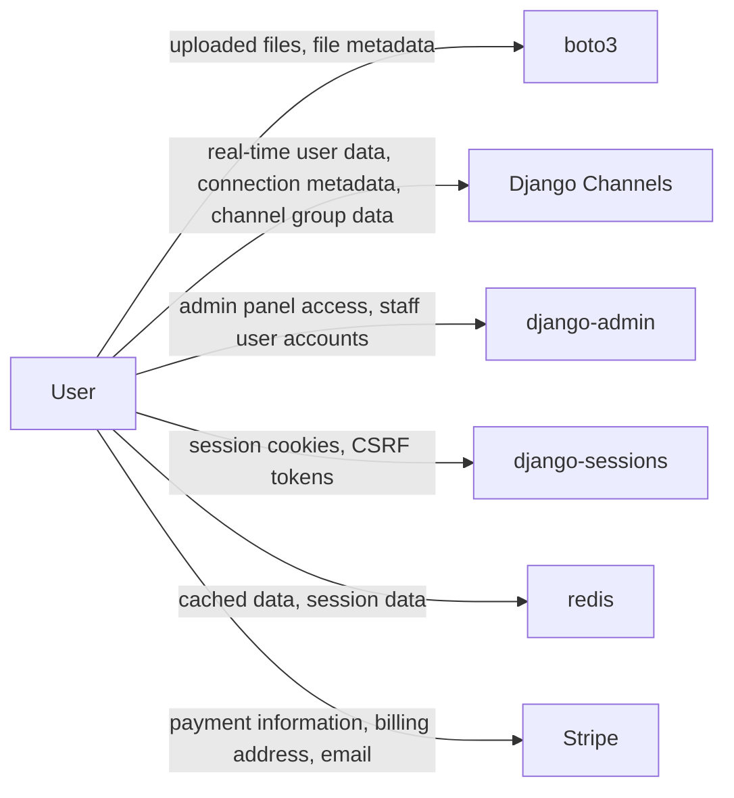

# Data Flow Diagram

> **Document Version:** 1.0  
> **Document Owner:** [Your Company Name]  
> **Next Review Date:** 2027-03-16

**Last updated:** 2026-03-16

**Project:** saleor

**Company:** [Your Company Name]

## Related Documents

- Data Flow Map (`DATA_FLOW_MAP.md`)
- Privacy Policy (`PRIVACY_POLICY.md`)

---

> This document provides a visual representation of how personal data flows through the application. The diagram below is rendered using [Mermaid](https://mermaid.js.org/) and can be viewed directly on GitHub, GitLab, or any Mermaid-compatible renderer.

## Visual Data Flow

## Legend

| Symbol | Meaning |
|--------|---------|
| **User** | End user of the application |
| **Arrow labels** | Types of personal data transmitted |
| **Service nodes** | Third-party or internal services processing data |

## Data Flow Details

### Collection Points

| Source | Data Collected | Mechanism |
|--------|---------------|-----------|
| User registration/login | admin panel access, staff user accounts | via django-admin |
| User registration/login | session cookies, CSRF tokens | via django-sessions |
| Payment checkout | payment information, billing address, email, transaction history | via stripe |

### Third-Party Data Sharing

| Recipient | Category | Data Shared |
|-----------|----------|-------------|
| Django Channels | Third-Party Service | real-time user data, connection metadata, channel group data, WebSocket messages |
| stripe | Payment Processing | payment information, billing address, email, transaction history |

## Service Inventory

| Service | Category | Data Processed |
|---------|----------|---------------|
| boto3 | storage | uploaded files, file metadata |
| Django Channels | other | real-time user data, connection metadata, channel group data, WebSocket messages |
| django-admin | auth | admin panel access, staff user accounts |
| django-sessions | auth | session cookies, CSRF tokens |
| redis | database | cached data, session data |
| Stripe | payment | payment information, billing address, email, transaction history |

---

## How to Use This Diagram

1. **GitHub/GitLab:** The Mermaid diagram renders automatically in markdown preview
2. **VS Code:** Install the "Markdown Preview Mermaid Support" extension
3. **Export:** Use [Mermaid Live Editor](https://mermaid.live/) to export as SVG or PNG
4. **CI/CD:** Use `@mermaid-js/mermaid-cli` to generate images in your pipeline

For questions about this data flow diagram, contact [your-email@example.com].

---

*This data flow diagram was generated by [Codepliant](https://github.com/joechensmartz/codepliant) based on automated code analysis. Review and verify all data flows for accuracy. This document does not constitute legal advice.*