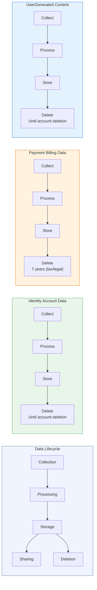

# Data Lifecycle Diagram — [Your Company Name]

> Auto-generated by Codepliant on 2026-03-16.
> Shows the full data lifecycle from collection through deletion for each data type.
> **Document Version:** 1.0  
> **Document Owner:** [Your Company Name]  
> **Next Review Date:** 2027-03-16

## Lifecycle Overview

All personal data processed by this application follows a defined lifecycle:

**Collection** — Data is gathered from users or systems
**Processing** — Data is used for its intended purpose
**Storage** — Data is persisted with appropriate safeguards
**Sharing** — Data may be transferred to authorized third parties
**Deletion** — Data is removed per retention schedule or on request

## Lifecycle Diagram

## Retention Summary

| Data Type | Retention Period | Deletion Trigger |
|-----------|-----------------|------------------|
| Identity & Account Data | Until account deletion | On account deletion request or DSAR |
| Payment & Billing Data | 7 years (tax/legal) | Transaction records retained per legal obligation |
| User-Generated Content | Until account deletion | On user request or account deletion |

## Detailed Lifecycle per Data Type

### Identity & Account Data

**Sources:** django-admin, django-sessions

| Stage | Description |
|-------|-------------|
| Collection | User registration, OAuth login, profile updates |
| Processing | Authentication, session management, access control |
| Storage | Encrypted at rest in auth provider and local database |
| Sharing | Auth provider only; not shared with third parties |
| Retention | Until account deletion |
| Deletion | On account deletion request or DSAR; cascades to all linked data |

### Payment & Billing Data

**Sources:** stripe

| Stage | Description |
|-------|-------------|
| Collection | Checkout flow, subscription management, invoicing |
| Processing | Payment tokenization, fraud detection, tax calculation |
| Storage | Tokenized by payment processor; no raw card data stored |
| Sharing | Payment processor, tax authority (as required by law) |
| Retention | 7 years (tax/legal) |
| Deletion | Transaction records retained per legal obligation; tokens revoked on request |

### User-Generated Content

**Sources:** boto3, redis

| Stage | Description |
|-------|-------------|
| Collection | File uploads, form submissions, user-created content |
| Processing | Validation, transformation, indexing |
| Storage | Database and/or object storage with encryption at rest |
| Sharing | Not shared externally unless user explicitly shares |
| Retention | Until account deletion |
| Deletion | On user request or account deletion; backups purged within 30 days |

## Lifecycle Stage Details

### Collection

Data is collected through the following channels:

- **Identity & Account Data**: User registration, OAuth login, profile updates
- **Payment & Billing Data**: Checkout flow, subscription management, invoicing
- **User-Generated Content**: File uploads, form submissions, user-created content

### Processing

Data is processed for the following purposes:

- **Identity & Account Data**: Authentication, session management, access control
- **Payment & Billing Data**: Payment tokenization, fraud detection, tax calculation
- **User-Generated Content**: Validation, transformation, indexing

### Storage

Data is stored with the following safeguards:

- **Identity & Account Data**: Encrypted at rest in auth provider and local database
- **Payment & Billing Data**: Tokenized by payment processor; no raw card data stored
- **User-Generated Content**: Database and/or object storage with encryption at rest

### Sharing

Data sharing is limited to:

- **Identity & Account Data**: Auth provider only; not shared with third parties
- **Payment & Billing Data**: Payment processor, tax authority (as required by law)
- **User-Generated Content**: Not shared externally unless user explicitly shares

### Deletion

Data deletion follows these procedures:

- **Identity & Account Data**: On account deletion request or DSAR; cascades to all linked data
- **Payment & Billing Data**: Transaction records retained per legal obligation; tokens revoked on request
- **User-Generated Content**: On user request or account deletion; backups purged within 30 days

---

*This data lifecycle diagram is generated from automated code analysis. Actual data flows may include additional processing not captured by code scanning. This does not constitute legal advice. Have this document reviewed by qualified compliance professionals.*
