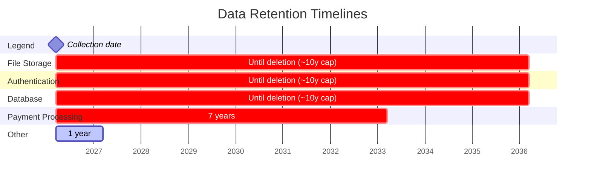
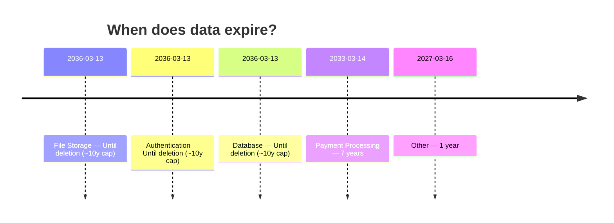
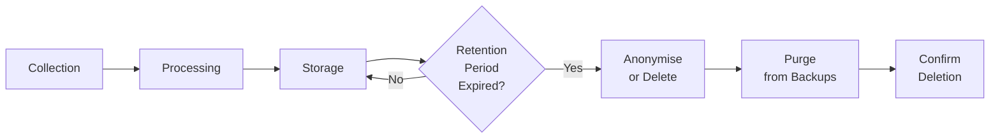

# Data Retention Schedule — Visual

> **Document Version:** 1.0  
> **Document Owner:** [Your Company Name]  
> **Next Review Date:** 2027-03-16

**Organisation:** [Your Company Name]
**Project:** saleor
**Generated:** 2026-03-16

---

> This document provides a visual Gantt-chart representation of data retention timelines for every service category detected in your project. Use it alongside the [Data Retention Policy](DATA_RETENTION_POLICY.md) for a complete picture.

## Retention Timeline

## Retention Summary

| Category | Retention Period | Days | Risk Level |
|----------|-----------------|------|------------|
| File Storage | Until deletion (~10y cap) | 3650 | High |
| Authentication | Until deletion (~10y cap) | 3650 | High |
| Database | Until deletion (~10y cap) | 3650 | High |
| Payment Processing | 7 years | 2555 | High |
| Other | 1 year | 365 | Moderate |

## Expiry Timeline

## Data Lifecycle Phases

Each data category follows this lifecycle. The retention period (shown in the Gantt chart above) governs how long data remains in the **Storage** phase before progressing to deletion.

## Retention Risk Heat Map

| Risk Level | Categories | Recommended Action |
|-----------|------------|-------------------|
| **High** (7+ years) | File Storage, Authentication, Database, Payment Processing | Verify legal obligation; minimise where possible |
| **Moderate** (1–7 years) | Other | Review annually; ensure consent is current |
| **Low** (< 1 year) | None | Automated purge in place |

## Contact

For questions about data retention schedules:

- **Email:** [your-email@example.com]

---

*This Data Retention Schedule Visual was generated by [Codepliant](https://github.com/joechensmartz/codepliant) based on automated code analysis. Retention periods are based on regulatory best practices and should be reviewed by your legal and compliance teams.*