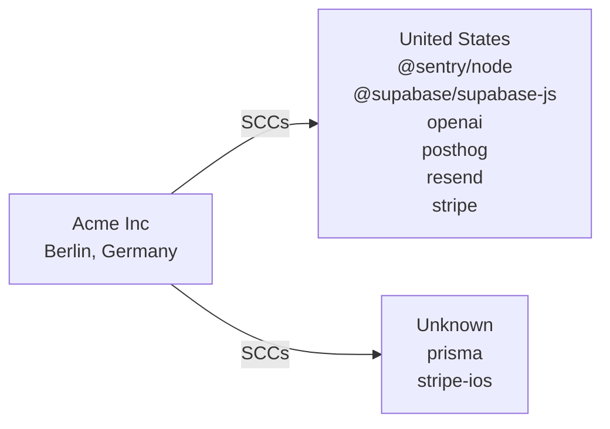

# Cross-Border Data Transfer Map

> **Document Version:** 1.0  
> **Document Owner:** Acme Inc  
> **Next Review Date:** 2027-03-18

**Organisation:** Acme Inc
**Data Exporter Location:** Berlin, Germany
**Project:** nextjs-saas-example
**Generated:** 2026-03-18

---

> This document maps all international data transfers identified through code analysis. It identifies the destination country, service provider, data types transferred, and applicable legal safeguards for each transfer. Required under GDPR Chapter V (Articles 44-49) for EU data exporters.

## Transfer Flow Diagram

## Transfer Summary by Country

| Country | Services | Data Types | Safeguard | Adequacy Decision |
|---------|----------|-----------|-----------|-------------------|
| United States (US) | @sentry/node, @supabase/supabase-js, openai, posthog, resend, stripe | error data, stack traces, user context, device information | SCCs | No |
| Unknown (??) | prisma, stripe-ios | user data as defined in schema, payment information, billing address, email | [Verify with provider] | No |

## Detailed Transfer Register

| # | Service | Category | Country | Data Types | Safeguard | DPF Certified | DPA in Place |
|---|---------|----------|---------|-----------|-----------|---------------|-------------|
| 1 | @sentry/node | monitoring | United States | error data, stack traces, user context | SCCs | N/A | [ ] |
| 2 | @supabase/supabase-js | auth | United States | email, password hash, session data | SCCs | N/A | [ ] |
| 3 | openai | ai | United States | user prompts, conversation history, generated content | EU-US DPF / SCCs | [Verify](https://www.dataprivacyframework.gov/list) | [ ] |
| 4 | posthog | analytics | United States | user behavior, session recordings, feature flag usage | SCCs | N/A | [ ] |
| 5 | prisma | database | Unknown | user data as defined in schema | [Verify with provider] | N/A | [ ] |
| 6 | resend | email | United States | email addresses, email content | SCCs | N/A | [ ] |
| 7 | stripe | payment | United States | payment information, billing address, email | EU-US DPF / SCCs | [Verify](https://www.dataprivacyframework.gov/list) | [ ] |
| 8 | stripe-ios | payment | Unknown | payment information, billing address, email | [Verify with provider] | N/A | [ ] |

## Services Requiring Additional Safeguards

The following services transfer data to countries without an EU adequacy decision. Additional safeguards (SCCs + supplementary measures) are required per the Schrems II ruling.

### @sentry/node

- **Destination:** United States
- **Safeguard:** SCCs
- **Data:** error data, stack traces, user context, device information, IP address
- **Required actions:**
  - [ ] Execute Standard Contractual Clauses (Module 2: Controller to Processor)
  - [ ] Complete Annex I (List of parties)
  - [ ] Complete Annex II (Technical and organisational measures)
  - [ ] Verify provider's DPF certification status
  - [ ] Implement supplementary encryption measures if needed

### @supabase/supabase-js

- **Destination:** United States
- **Safeguard:** SCCs
- **Data:** email, password hash, session data, user metadata
- **Required actions:**
  - [ ] Execute Standard Contractual Clauses (Module 2: Controller to Processor)
  - [ ] Complete Annex I (List of parties)
  - [ ] Complete Annex II (Technical and organisational measures)
  - [ ] Verify provider's DPF certification status
  - [ ] Implement supplementary encryption measures if needed

### posthog

- **Destination:** United States
- **Safeguard:** SCCs
- **Data:** user behavior, session recordings, feature flag usage, device information
- **Required actions:**
  - [ ] Execute Standard Contractual Clauses (Module 2: Controller to Processor)
  - [ ] Complete Annex I (List of parties)
  - [ ] Complete Annex II (Technical and organisational measures)
  - [ ] Verify provider's DPF certification status
  - [ ] Implement supplementary encryption measures if needed

### prisma

- **Destination:** Unknown
- **Safeguard:** [Verify with provider]
- **Data:** user data as defined in schema
- **Required actions:**
  - [ ] Execute Standard Contractual Clauses (Module 2: Controller to Processor)
  - [ ] Complete Annex I (List of parties)
  - [ ] Complete Annex II (Technical and organisational measures)
  - [ ] Verify provider's DPF certification status
  - [ ] Implement supplementary encryption measures if needed

### resend

- **Destination:** United States
- **Safeguard:** SCCs
- **Data:** email addresses, email content
- **Required actions:**
  - [ ] Execute Standard Contractual Clauses (Module 2: Controller to Processor)
  - [ ] Complete Annex I (List of parties)
  - [ ] Complete Annex II (Technical and organisational measures)
  - [ ] Verify provider's DPF certification status
  - [ ] Implement supplementary encryption measures if needed

### stripe-ios

- **Destination:** Unknown
- **Safeguard:** [Verify with provider]
- **Data:** payment information, billing address, email, transaction history
- **Required actions:**
  - [ ] Execute Standard Contractual Clauses (Module 2: Controller to Processor)
  - [ ] Complete Annex I (List of parties)
  - [ ] Complete Annex II (Technical and organisational measures)
  - [ ] Verify provider's DPF certification status
  - [ ] Implement supplementary encryption measures if needed

## Data Type × Service Matrix

| Data Type | @sentry/node | @supabase/supabase-js | openai | posthog | prisma | resend | stripe | stripe-ios |
| --- | --- | --- | --- | --- | --- | --- | --- | --- |
| error data | ● | — | — | — | — | — | — | — |
| stack traces | ● | — | — | — | — | — | — | — |
| user context | ● | — | — | — | — | — | — | — |
| device information | ● | — | — | ● | — | — | — | — |
| IP address | ● | — | — | — | — | — | — | — |
| email | — | ● | — | — | — | — | ● | ● |
| password hash | — | ● | — | — | — | — | — | — |
| session data | — | ● | — | — | — | — | — | — |
| user metadata | — | ● | — | — | — | — | — | — |
| user prompts | — | — | ● | — | — | — | — | — |
| conversation history | — | — | ● | — | — | — | — | — |
| generated content | — | — | ● | — | — | — | — | — |
| user behavior | — | — | — | ● | — | — | — | — |
| session recordings | — | — | — | ● | — | — | — | — |
| feature flag usage | — | — | — | ● | — | — | — | — |
| user data as defined in schema | — | — | — | — | ● | — | — | — |
| email addresses | — | — | — | — | — | ● | — | — |
| email content | — | — | — | — | — | ● | — | — |
| payment information | — | — | — | — | — | — | ● | ● |
| billing address | — | — | — | — | — | — | ● | ● |
| transaction history | — | — | — | — | — | — | ● | ● |

## Transfer Compliance Checklist

- [ ] All transfers have a valid legal basis under GDPR Chapter V
- [ ] SCCs (2021 version) executed with all non-DPF-certified providers
- [ ] DPF certification verified for applicable US providers
- [ ] Transfer Impact Assessment completed for each non-adequate country
- [ ] Supplementary measures implemented where SCCs are relied upon
- [ ] Data Processing Agreements in place with all processors
- [ ] Record of Processing Activities updated with transfer details
- [ ] Privacy Policy discloses international transfers and safeguards
- [ ] DPO informed of all cross-border transfers

## Review Schedule

| Review | Frequency | Next Due |
|--------|-----------|----------|
| Full transfer map review | Annual | 2027-03-18 |
| DPF certification verification | Semi-annual | [Set date] |
| New service onboarding review | Per event | Ongoing |
| Regulatory change assessment | Quarterly | [Set date] |

**Contact:** legal@acme.com
**Data Protection Officer:** dpo@acme-saas.com

---

*This Cross-Border Transfer Map was auto-generated by [Codepliant](https://github.com/joechensmartz/codepliant) based on code analysis. Service location and DPF certification status should be verified with each provider's current documentation. This document does not constitute legal advice.*
