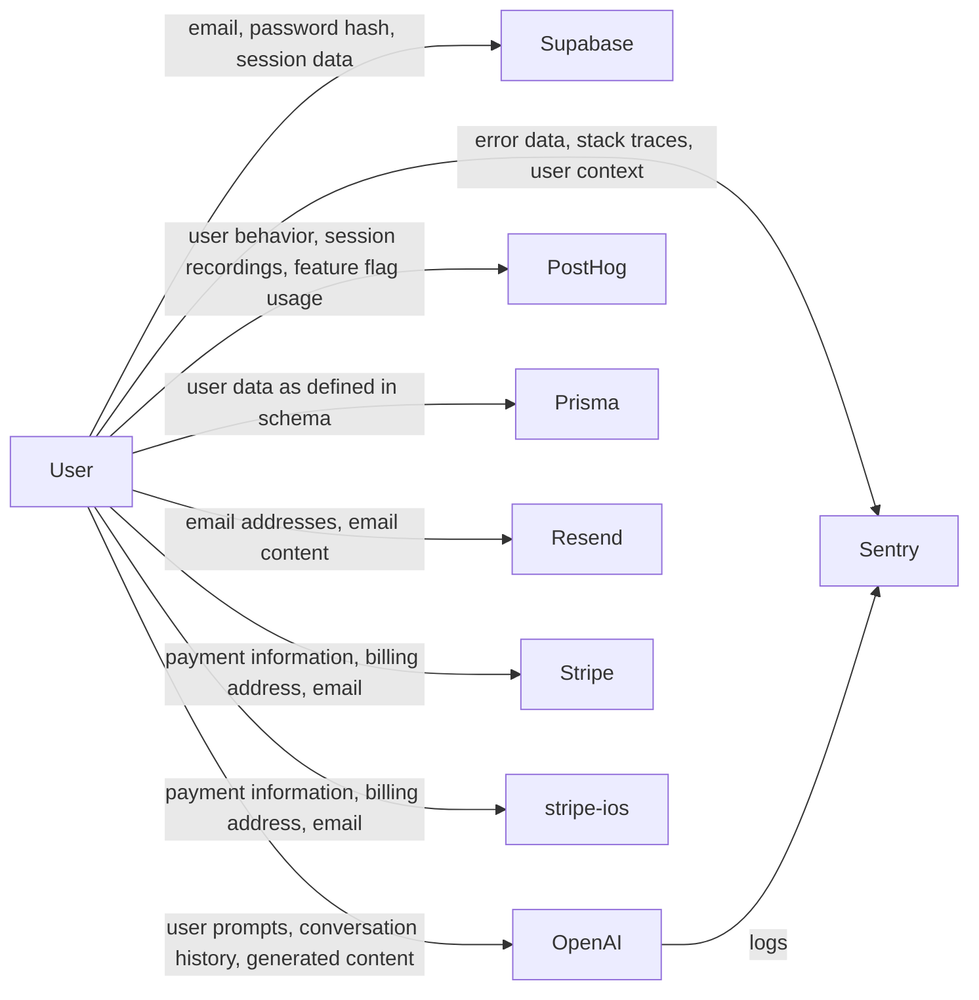

> **Document Version:** 1.0  
> **Document Owner:** Acme Inc  
> **Next Review Date:** 2027-03-18

**Last updated:** 2026-03-18

**Project:** nextjs-saas-example

**Company:** Acme Inc

## Related Documents

- Data Flow Map (`DATA_FLOW_MAP.md`)
- Privacy Policy (`PRIVACY_POLICY.md`)

---

> This document provides a visual representation of how personal data flows through the application. The diagram below is rendered using [Mermaid](https://mermaid.js.org/) and can be viewed directly on GitHub, GitLab, or any Mermaid-compatible renderer.

## Visual Data Flow

## Legend

| Symbol | Meaning |
|--------|---------|
| **User** | End user of the application |
| **Arrow labels** | Types of personal data transmitted |
| **Service nodes** | Third-party or internal services processing data |

## Data Flow Details

### Collection Points

| Source | Data Collected | Mechanism |
|--------|---------------|-----------|
| User registration/login | email, password hash, session data, user metadata | via @supabase/supabase-js |
| AI-powered feature usage | user prompts, conversation history, generated content | via openai |
| Email subscription/contact forms | email addresses, email content | via resend |
| Payment checkout | payment information, billing address, email, transaction history | via stripe |
| Payment checkout | payment information, billing address, email, transaction history | via stripe-ios |

### Third-Party Data Sharing

| Recipient | Category | Data Shared |
|-----------|----------|-------------|
| @sentry/node | Error Monitoring | error data, stack traces, user context, device information, IP address |
| openai | AI Service | user prompts, conversation history, generated content |
| posthog | Analytics | user behavior, session recordings, feature flag usage, device information |
| resend | Email Service | email addresses, email content |
| stripe | Payment Processing | payment information, billing address, email, transaction history |
| stripe-ios | Payment Processing | payment information, billing address, email, transaction history |

## Service Inventory

| Service | Category | Data Processed |
|---------|----------|---------------|
| Sentry | monitoring | error data, stack traces, user context, device information, IP address |
| Supabase | auth | email, password hash, session data, user metadata |
| OpenAI | ai | user prompts, conversation history, generated content |
| PostHog | analytics | user behavior, session recordings, feature flag usage, device information |
| Prisma | database | user data as defined in schema |
| Resend | email | email addresses, email content |
| Stripe | payment | payment information, billing address, email, transaction history |
| stripe-ios | payment | payment information, billing address, email, transaction history |

---

## How to Use This Diagram

1. **GitHub/GitLab:** The Mermaid diagram renders automatically in markdown preview
2. **VS Code:** Install the "Markdown Preview Mermaid Support" extension
3. **Export:** Use [Mermaid Live Editor](https://mermaid.live/) to export as SVG or PNG
4. **CI/CD:** Use `@mermaid-js/mermaid-cli` to generate images in your pipeline

For questions about this data flow diagram, contact legal@acme.com.

---

*This data flow diagram was generated by [Codepliant](https://github.com/joechensmartz/codepliant) based on automated code analysis. Review and verify all data flows for accuracy. This document does not constitute legal advice.*